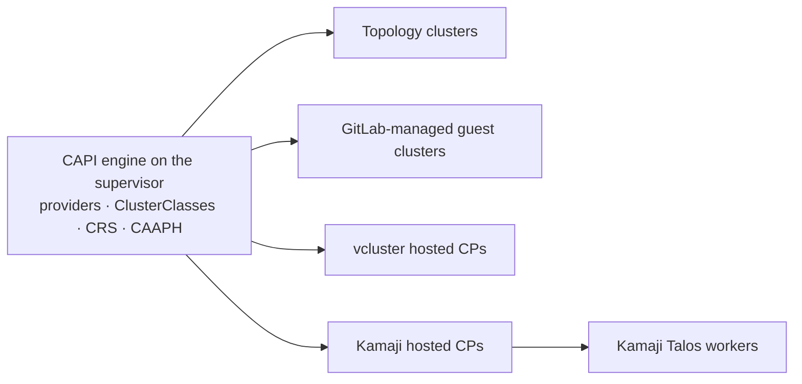

Every tenant cluster in Celum lives on a [supervisor](/concepts/supervisors-and-clusters), and every supervisor runs a **Cluster API (CAPI) engine** that Celum installs and operates. On top of that one engine the platform offers four distinct cluster models — they differ in how a cluster is described, where its definition lives, and how much of a cluster you actually get.

<Note>
  `<supervisor>` and `<cluster>` are placeholders throughout — substitute your own names.
</Note>

## The four cluster models

| Model | What you describe | Where the definition lives |
| --- | --- | --- |
| **CAPI topology cluster** | A declarative spec: cluster class, Kubernetes version, control-plane replicas + VM size, worker groups | Applied **directly to the supervisor** via `POST /api/supervisors/<supervisor>/capi/clusters` — no Git involved |
| **GitLab-managed guest cluster** (legacy) | Configuration files for a GitOps repository | Committed to the supervisor's attached GitLab repo (`/api/supervisors/<supervisor>/guest-clusters`, `/api/clusters/create`) |
| **vcluster hosted control plane** | A virtual cluster whose control plane runs as pods on the supervisor, sharing its nodes | A flat `Cluster` + `VCluster` CR on the supervisor (`POST /api/supervisors/<supervisor>/capi/vclusters`) |
| **Kamaji Talos workers** | A Talos worker pool attached to a Kamaji hosted control plane | Reconciled on demand via `POST /api/supervisors/<supervisor>/capi/clusters/<cluster>/kamaji-talos-workers` |

Only the second model is GitLab-based. Topology clusters, vclusters, and Kamaji workers are applied straight to the supervisor's API — creating one commits nothing to any repository.



## Topology clusters

The primary model. A topology cluster is one declarative spec — Celum reads it back in the same shape for editing (`GET /api/supervisors/<supervisor>/capi/clusters/<cluster>`), updates it with `PUT`, and deletes it with a single `DELETE` that cascades through everything the `Cluster` CR owns:

```json
{
  "name": "demo-cl",
  "namespace": "proj-demo",
  "clusterClass": "talos-kubevirt",
  "kubernetesVersion": "v1.36.2",
  "controlPlaneReplicas": 1,
  "controlPlaneVmSize": { "numCPUs": 2, "memoryMiB": 4096, "diskGiB": 20 },
  "workerGroups": [
    { "name": "md0", "class": "default-worker", "replicas": 6,
      "vmSize": { "numCPUs": 2, "memoryMiB": 4096, "diskGiB": 20 } }
  ],
  "podsCidr": "10.246.0.0/16",
  "servicesCidr": "10.113.0.0/16",
  "addons": { "cniCilium": true, "platformAddons": true, "monitoring": true, "logs": true, "flows": true },
  "tenantLB": { "enabled": true, "pool": "project" }
}
```

The `addons` block is what the CAAPH engine (below) acts on, and `tenantLB` wires the guest's LoadBalancer Services into the supervisor's [IP pools](/networking/pools-and-ipam). Clusters created inside a [project](/concepts/projects) land in that project's namespace.


## GitLab-managed guest clusters

The legacy model, still first-class where a supervisor has an attached GitOps repository: the cluster is a set of configuration files that Celum generates, previews, and commits (`POST /api/clusters/preview`, `POST /api/clusters/create`), then reconciliation on the supervisor builds the cluster. Updates and deletes are further commits (`PUT /api/supervisors/<supervisor>/guest-clusters/<cluster>`, `DELETE /api/clusters/<cluster>/delete`). The [create page](/clusters/create) walks through both this flow and the topology flow.

## Hosted control planes

When a tenant needs API-server isolation but not its own machines, a **vcluster** gives them a full Kubernetes control plane running as pods, sharing the supervisor's nodes. **Kamaji Talos workers** go one step further: a hosted control plane plus real Talos worker VMs attached to it. Both are covered in [Hosted control planes](/clusters/hosted-control-planes).

## The CAPI engine

Everything above depends on the engine Celum installs per supervisor during onboarding. It reports state through the standard [component-status model](/platform-health/overview) and is managed with:

| Concern | Endpoints |
| --- | --- |
| Install / status / recover | `POST /api/supervisors/<supervisor>/capi/install` · `GET .../capi/status` · `POST .../capi/recover-rollback` |
| Providers | `GET /api/capi/provider-versions` (release dropdown) · `POST /api/capi/vsphere-probe` (vCenter TLS thumbprint) |
| ClusterClasses | `POST .../capi/clusterclasses/install` · `GET .../cluster-classes` |
| ClusterResourceSets | `GET .../cluster-resource-sets` · `POST .../cluster-resource-sets/install` |
| CAAPH addon engine | `POST .../capi/addons` · `GET .../capi/addons/status` |
| Version discovery | `GET .../kubernetes-versions` |

`GET /api/supervisors/<supervisor>/capi/status` shows the operator release plus every provider — core, bootstrap, control plane (including Kamaji), and infrastructure:

```json
{
  "helmRelease": { "exists": true, "ready": true, "revision": "0.27.0" },
  "coreProvider": { "exists": true, "ready": true, "installedVersion": "v1.13.2" },
  "bootstrap": { "talos": { "exists": true, "ready": true, "installedVersion": "v0.7.0-alpha.2" } },
  "controlPlane": {
    "kamaji": { "exists": true, "ready": true, "installedVersion": "v0.20.0" },
    "talos": { "exists": true, "ready": true, "installedVersion": "v0.6.0-pr251" }
  },
  "infrastructure": {
    "kubevirt": { "exists": true, "ready": true, "installedVersion": "v0.11.2" },
    "vsphere": { "exists": true, "ready": true, "installedVersion": "v1.16.1" }
  }
}
```

The **CAAPH addon engine** (Cluster API Addon Provider for Helm) delivers platform charts into every guest — CNI, monitoring agents, CSI — as `HelmChartProxy` objects per namespace. Its status endpoint reports the provider and each proxy's readiness:

```json
{
  "provider": { "exists": true, "ready": true, "installedVersion": "v0.3.2" },
  "helmChartProxyCRD": true,
  "proxies": [
    { "name": "cilium-for-guests", "namespace": "proj-demo", "ready": true },
    { "name": "prometheus-agent-for-guests", "namespace": "proj-demo", "ready": true },
    { "name": "cluster-agent-for-guests", "namespace": "proj-demo", "ready": true }
  ],
  "installedChartVersion": "0.6.11"
}
```

## Which model when

<Steps>
  <Step title="A tenant needs a real cluster with its own nodes — topology cluster">
    The default. Declarative spec, direct apply, full edit/delete lifecycle, addons delivered automatically.
  </Step>
  <Step title="The supervisor's cluster inventory must live in Git — GitLab-managed">
    Choose this when review-by-merge-request and a versioned cluster definition are requirements. Requires an attached repository.
  </Step>
  <Step title="API-server isolation without dedicated machines — vcluster">
    Seconds to create, near-zero infrastructure cost, shares the supervisor's nodes. Not suitable when the tenant needs its own kernel, CNI, or node-level configuration.
  </Step>
  <Step title="A hosted control plane with real worker nodes — Kamaji Talos workers">
    The control plane runs as supervisor pods, workers are Talos VMs. Good middle ground when control-plane VMs are the cost you want to avoid.
  </Step>
</Steps>

## Permissions

| Task | Action |
| --- | --- |
| Read engine / addon status | `capi:GetStatus` |
| Install engine, providers, ClusterClasses, addons; recover a rollback | `capi:Install` |
| Create a cluster (any model) | `cluster:Create` |
| Update / delete a cluster | `cluster:Update` / `cluster:Delete` |
| List ClusterClasses for the create form | `discovery:ListClusterClasses` |
| Install the built-in ClusterResourceSets | `supervisor:Bootstrap` |

<Note>
  The in-product assistant, **Celum AI**, answers cluster questions from these same APIs — `list_clusters`, `get_guest_cluster`, and `get_component_status` (component `capi` or `capi-addons`) read the identical data these pages render.
</Note>

## The Clusters pages

<CardGroup cols={2}>
  <Card title="Create a cluster" icon="circle-plus" href="/clusters/create">
    The three creation flows — template wizard, standard form, ClusterClass form.
  </Card>

  <Card title="Templates & addons" icon="copy" href="/clusters/templates">
    Reusable blueprints with Go-template variables, and CRS addons pushed into guests.
  </Card>

  <Card title="Day-2 operations" icon="gauge-high" href="/clusters/day-2-operations">
    Everything read inside a running tenant — nodes, events, metrics, Helm, workloads.
  </Card>

  <Card title="Hosted control planes" icon="boxes-stacked" href="/clusters/hosted-control-planes">
    vcluster instances and Kamaji Talos workers.
  </Card>
</CardGroup>
