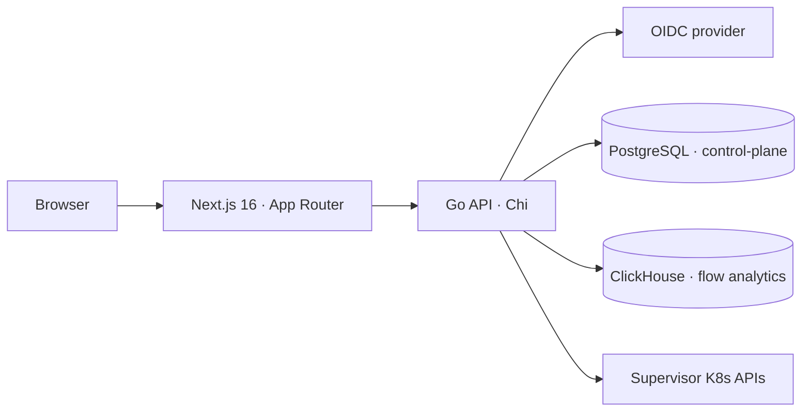

Celum is a Next.js dashboard backed by a Go API. The backend owns authentication, evaluates IAM, talks to each supervisor's Kubernetes API, and stores control-plane data in PostgreSQL and network-flow analytics in ClickHouse.

## Components

<CardGroup cols={2}>
  <Card title="Frontend" icon="react">
    Next.js 16 (App Router) \+ React 19, TypeScript, Tailwind, shadcn/ui.
  </Card>

  <Card title="Backend" icon="golang">
    Go with the Chi router; a dynamic Kubernetes client per supervisor.
  </Card>

  <Card title="PostgreSQL" icon="database">
    Control-plane state: supervisors, cluster templates, addons, IAM policies/ groups, audit logs, cached data.
  </Card>

  <Card title="ClickHouse" icon="chart-line">
    Network-flow analytics powering the security topology and forensics views.
  </Card>
</CardGroup>

## Request pipeline

Every API request passes through an ordered middleware chain before reaching a handler:

<Steps>
  <Step title="Tracing + access log">
    An OpenTelemetry span (named after the route pattern) and a structured access log line.
  </Step>
  <Step title="Recoverer">
    Panics are caught and turned into `500`s instead of crashing the process.
  </Step>
  <Step title="CORS">
    Cross-origin handling scoped to the configured frontend origin.
  </Step>
  <Step title="Session">
    Validates the `k8s-gate-session` cookie (or a Bearer API token) and puts the user's identity and groups into the request context.
  </Step>
  <Step title="Audit">
    Mutating requests (POST/PUT/DELETE) are recorded with user, action, resource, status, and duration.
  </Step>
  <Step title="Authorization (IAM)">
    The route is resolved to an action \+ KRN and checked against the user's policies. See [Permissions model](/concepts/permissions-model).
  </Step>
</Steps>

## Multi-supervisor model

Celum manages many supervisor clusters at once. Each supervisor is a kubeconfig — provided as a file (filename = supervisor name) or stored in the database. An empty supervisor name resolves to a synthesized `__default__`. Kubernetes clients are cached per supervisor, and every supervisor call is tagged with its name in traces. See [Supervisors & clusters](/concepts/supervisors-and-clusters) for the full model.

### Provider detection

A cluster's provider is read from its Cluster API `spec.infrastructureRef.kind` and mapped to a friendly name — for example:

| `infrastructureRef.kind` | Provider |
| --- | --- |
| `VSphereCluster` | vSphere |
| `CloudStackCluster` | CloudStack |
| `KubevirtCluster` | Kubevirt |
| `AWSCluster` / `AzureCluster` / `GCPCluster` | AWS / Azure / GCP |
| `VCluster` | vCluster |
| `Metal3Cluster` | Bare Metal |

Unmapped kinds fall back to the kind name with the `Cluster` suffix stripped.

## Data fetching

The frontend uses two helpers, never raw `fetch`:

| Helper | Used in | Behavior |
| --- | --- | --- |
| `serverFetch` | Server Components | Server-to-backend call, forwards the session cookie, no caching |
| `auditFetch` | Client Components | Sends credentials, resolves the API URL at runtime, surfaces access-denied errors |

The client API base URL is injected at request time via a runtime-config script (`window.__APP_CONFIG__`), so the same build runs against any environment.

## Observability

The backend emits OpenTelemetry traces over OTLP/HTTP when `OTEL_EXPORTER_OTLP_ENDPOINT` is set (a no-op tracer otherwise, so there's no overhead when unconfigured). Spans cover HTTP handlers, per-supervisor Kubernetes calls, and PostgreSQL/ClickHouse queries, and structured logs carry the active trace ID for correlation.

## Performance patterns

Read-only endpoints that hit a supervisor's API use a stale-while-revalidate cache: fresh values are served immediately, stale values are returned while a refresh runs in the background, and a cold miss is bounded by a short timeout with an empty fallback — so one unreachable supervisor can't hang a page. Helm release listings use a fast path that reads release Secrets directly, avoiding the Kubernetes API discovery cost.

<Note>
  A consequence worth knowing: a page can show data from a supervisor that has since become unreachable. Values are served stale while a refresh runs behind them, and a cold miss returns empty rather than an error.
</Note>

## Backend layout

The Go backend is organized under `backend/internal/`:

| Package | Responsibility |
| --- | --- |
| `api` | HTTP handlers \+ middleware |
| `auth` | OIDC, JWT sessions, session middleware |
| `iam` | KRN engine, policy evaluation, authorization middleware |
| `k8s` | Kubernetes operations \+ provider detection |
| `kubeconfig` | Multi-supervisor loading and client caching |
| `db` | PostgreSQL persistence \+ migrations |
| `clickhouse` | Flow-analytics store |
| `helm` | Fast Helm release reads |
| `cache` | TTL cache with background refresh |
| `config` | Environment configuration |
| `telemetry` | OpenTelemetry tracing \+ logging |

Plus integration packages for DNS, IPAM, GitOps, and related services.

## Related

<CardGroup cols={2}>
  <Card title="Supervisors & clusters" icon="layer-group" href="/concepts/supervisors-and-clusters">
    How supervisors are discovered, named, and cached.
  </Card>

  <Card title="Permissions model" icon="shield-halved" href="/concepts/permissions-model">
    How a request becomes an action \+ KRN, and how it is evaluated.
  </Card>
</CardGroup>