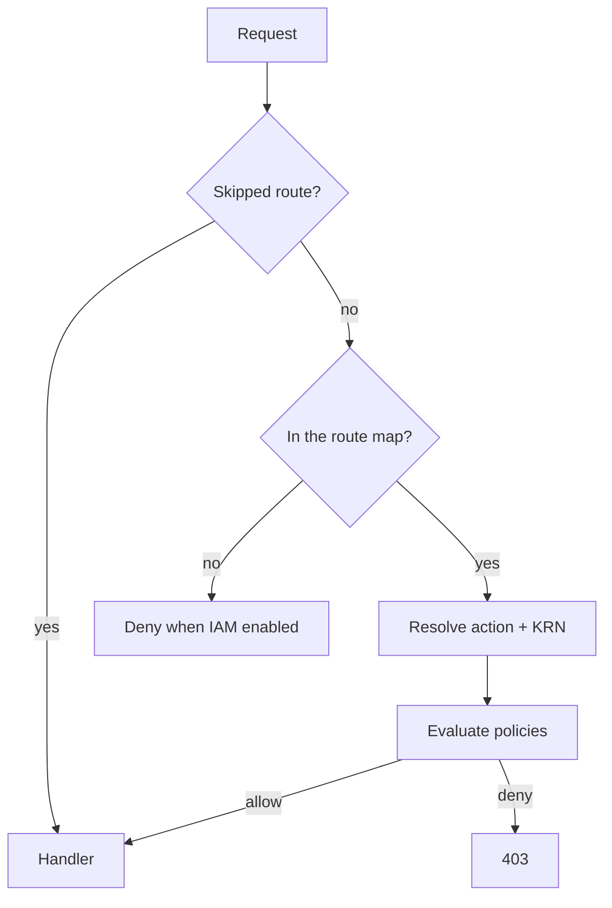

Every API request is reduced to two strings — an **action** like `cluster:Delete` and a **KRN** like `krn:vks:supervisor:<supervisor>:cluster:<cluster>` — and those two are checked against the policies attached to your groups. This page explains that reduction and the matching rules behind it. For setting OIDC up, see [Authentication & IAM](/get-started/authentication); for the full action list, see [Permissions reference](/reference/permissions).

## From request to decision



<Steps>
  <Step title="Skip list">
    A small set of routes never reaches IAM at all: the health check, the four `/auth/*` endpoints, and everything under `/api/iam/me/` (your own permissions, groups, and API tokens — self-service by definition). The MCP endpoint under `/mcp` is also skipped here because it authorizes per tool on re-dispatch.
  </Step>
  <Step title="Route lookup">
    The request's method and path are matched against the route map, whose keys are chi-style patterns such as `GET /api/supervisors/{name}/summary`. A `{placeholder}` segment matches any single segment; the number of segments must match exactly.
  </Step>
  <Step title="KRN resolution">
    The matched entry carries a KRN template. Placeholders are filled from the path — `{name}` from the supervisor segment, `{cluster}` from the cluster segment, and so on. `{?supervisor}` is filled from the `?supervisor` query parameter instead.
  </Step>
  <Step title="Evaluation">
    The action and the resolved KRN are checked against every statement in every policy attached to your groups.
  </Step>
</Steps>

<Warning>
  An empty placeholder value resolves to `*`, not to an empty string. A request with no `?supervisor` parameter is therefore checked against `krn:vks:supervisor:*:cluster:<cluster>` — any supervisor. Write policies for those routes so they are correct under that reading.
</Warning>

## Unmapped routes

If no entry in the route map matches, the request is **denied outright** when `IAM_ENABLED=true`. The response names the reason:

```json
{ "error": "Access denied", "action": "unmapped", "resource": "/api/..." }
```

No policy can grant an unmapped route — there is no action to allow. This is a fail-closed default: a new endpoint is unreachable until it is mapped, rather than silently reachable by everyone.

With `IAM_ENABLED=false`, the same request is logged and allowed.

## Actions

An action is `service:Verb` — `cluster:List`, `vm:Start`, `iam:CreatePolicy`. Policy statements match them three ways:

| Pattern | Matches |
| --- | --- |
| `cluster:List` | Exactly that action |
| `cluster:*` | Every action in the `cluster` service |
| `*:*` | Everything |

There is no partial-verb wildcard: `cluster:Get*` is not a pattern, it is a literal that will never match.

## KRNs

A KRN is colon-separated segments after the fixed `krn:vks:` prefix, alternating type and identifier:

```text
krn:vks:supervisor:<supervisor>
krn:vks:supervisor:<supervisor>:cluster:<cluster>
krn:vks:iam:policy:<id>
krn:vks:settings:global
```

### Matching rules

<AccordionGroup>
  <Accordion title="A trailing * matches everything remaining">
    `krn:vks:supervisor:*` matches `krn:vks:supervisor:prod` **and** `krn:vks:supervisor:prod:cluster:web`. A trailing wildcard is not "one more segment" — it is "the rest of the KRN, however deep".

    This is the rule most likely to surprise you. A statement meant to grant supervisor-level reads also covers every cluster, VM, gateway, and pool beneath that supervisor.
  </Accordion>

  <Accordion title="A * in the middle matches exactly one segment">
    `krn:vks:supervisor:*:cluster:*` matches any cluster on any supervisor. The first `*` consumes exactly the supervisor name.
  </Accordion>

  <Accordion title="Segment counts must otherwise match">
    Without a trailing wildcard, a pattern only matches a KRN with the same number of segments. `krn:vks:supervisor:prod` does **not** match `krn:vks:supervisor:prod:cluster:web` — grant the cluster resource explicitly, or use a trailing wildcard.
  </Accordion>

  <Accordion title="Prefix wildcards work inside a segment">
    `prod-*` matches `prod-cluster-1`. So `krn:vks:supervisor:*:cluster:prod-*` scopes a policy to clusters whose names start with `prod-`, on any supervisor.
  </Accordion>
</AccordionGroup>

## Policy documents

```json
{
  "version": "2024-01-01",
  "statements": [
    {
      "sid": "read-prod",
      "effect": "Allow",
      "actions": ["cluster:List", "cluster:Get", "cluster:GetNodes"],
      "resources": ["krn:vks:supervisor:*:cluster:prod-*"]
    },
    {
      "sid": "no-deletes",
      "effect": "Deny",
      "actions": ["cluster:Delete"],
      "resources": ["krn:vks:*"]
    }
  ]
}
```

A document is rejected unless it has at least one statement, and each statement has an `effect` of exactly `Allow` or `Deny`, at least one action, and at least one resource.

## Evaluation order

<Steps>
  <Step title="Start denied">
    With nothing matching, the answer is no.
  </Step>
  <Step title="Any matching Deny ends it">
    The first statement that matches both the action and the resource with `effect: Deny` returns denied immediately — no later Allow can override it, regardless of which policy or group it came from.
  </Step>
  <Step title="Otherwise, a matching Allow wins">
    If any statement matched with `effect: Allow` and nothing denied, the request proceeds.
  </Step>
</Steps>

Because deny is absolute, a broad `Deny` in one attached policy will override a narrow `Allow` in another. That is the intended way to carve exceptions out of `K8sGateAdmin`-shaped grants.

## Where your policies come from

Your effective policy set is the union of the policies attached to every group you belong to. You belong to a group when either is true:

- The group's mapped OIDC group value **exactly equals** one of the values in your token's claim (`groups` or `roles`, per `OIDC_MAPPING_SOURCE`).
- Your email is on the group's manual member list.

<Note>
  Group and policy data is cached and refreshed on a **30-second loop**. An IAM change can take up to half a minute to take effect for an already-signed-in user. Changes to the user's own claims require a fresh sign-in, since groups come from the token.
</Note>

## Enforcement modes

| `IAM_ENABLED` | Behaviour |
| --- | --- |
| `false` (default) | Every decision is evaluated and logged. Denials are logged as would-deny and the request **proceeds**. |
| `true` | Denials return `403`. Unmapped routes return `403`. |

Set `IAM_DEBUG=true` to log each check with the resolved action, KRN, and the statement that matched. It is the fastest way to answer "why was this denied" — the log names whether it was an explicit deny or the default deny, and how many policies were in play.

<Warning>
  Run with `IAM_ENABLED=false` only while you are shaping policies. It is not a degraded mode — it is no authorization at all.
</Warning>

## Audit trail

The resolved action and KRN are attached to the request before the handler runs, so the audit log records what was attempted in the same vocabulary policies are written in. Mutating requests are recorded with user, action, resource, status, and duration, and are browsable at `/audit-logs` with the `audit-log:List` permission.

## Related

<CardGroup cols={2}>
  <Card title="Permissions reference" icon="list-check" href="/reference/permissions">
    Every action, grouped by service, with its KRN shape.
  </Card>

  <Card title="Authentication & IAM" icon="key" href="/get-started/authentication">
    OIDC setup, built-in policies, and the first-admin bootstrap.
  </Card>

  <Card title="Supervisors & clusters" icon="layer-group" href="/concepts/supervisors-and-clusters">
    Why supervisor names appear inside KRNs.
  </Card>

  <Card title="Environment variables" icon="sliders" href="/reference/environment-variables">
    `IAM_ENABLED`, `IAM_DEBUG`, and the OIDC claim settings.
  </Card>
</CardGroup>