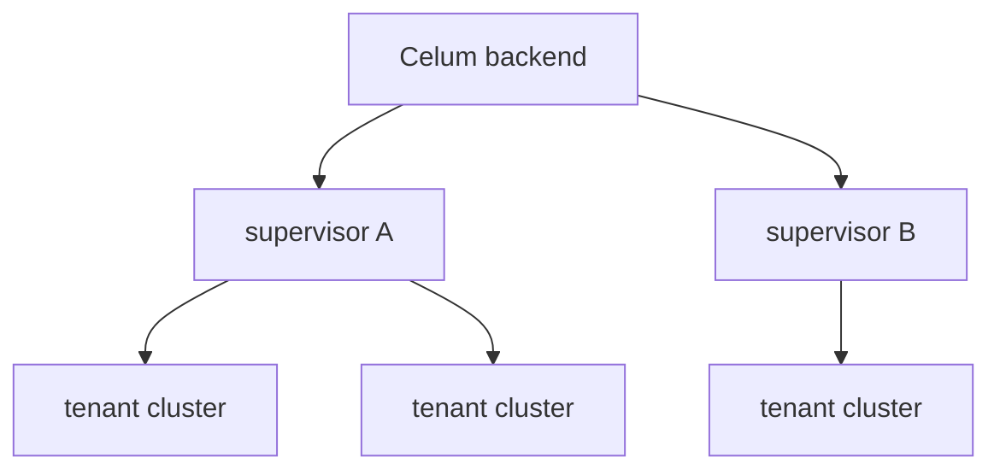

Everything in Celum hangs off two nouns. A **supervisor** is a Kubernetes cluster that runs Cluster API and that Celum holds a kubeconfig for. A **tenant cluster** (also called a guest cluster) is a Cluster API `Cluster` object living on a supervisor. Celum never invents either — it reads what is already there.



## What a supervisor is

A supervisor is, concretely, one kubeconfig plus the name Celum files it under. That name appears in the URL of every scoped page (`/s/<supervisor>/...`), in every API path (`/api/supervisors/<supervisor>/...`), and in every KRN (`krn:vks:supervisor:<supervisor>`).

### Where kubeconfigs come from

Celum reads supervisors from three sources, and a supervisor may come from any of them:

<CardGroup cols={2}>
  <Card title="A directory of files" icon="folder-open">
    Every file in `KUBECONFIGS_DIR` becomes a supervisor. **The filename is the supervisor name** — there is no name field inside the file that Celum reads.
  </Card>

  <Card title="The database" icon="database">
    Kubeconfigs uploaded through the UI are stored in PostgreSQL with a name, server URL, an optional platform label, and an optional site.
  </Card>

  <Card title="A single file" icon="file">
    `KUBECONFIG_PATH` names one kubeconfig, used as a fallback.
  </Card>

  <Card title="In-cluster" icon="cube">
    When Celum runs inside Kubernetes with no kubeconfig configured, it uses its own service account.
  </Card>
</CardGroup>

The last two produce a synthesized supervisor named `__default__`. An empty supervisor name in a request resolves to it, which is why single-supervisor deployments work without naming anything.

<Warning>
  Renaming a kubeconfig file renames the supervisor. Because the name is embedded in every KRN, IAM policies written against the old name stop matching, and the URLs your team has bookmarked break. Treat supervisor names as stable identifiers.
</Warning>

### Client caching

Kubernetes clients are built once per supervisor and cached. The cache is invalidated when a database-backed kubeconfig changes or is removed, so an uploaded credential takes effect without a restart. A kubeconfig **file** that changes on disk is not detected the same way — restart the backend after editing one.

### Labels and sites

Database-backed supervisors carry two optional descriptors:

| Field | Meaning |
| --- | --- |
| `label` | The platform behind the supervisor — for example `vmware`, `cloudstack`, `talos`. Used for grouping and iconography. |
| `site` | Free-text physical location. Sites are managed separately under `/settings` and are also attached to registries. |

Neither affects authorization. Both are descriptive only.

### Managing supervisors

| Task | Permission | KRN |
| --- | --- | --- |
| List supervisors | `supervisor:List` | `krn:vks:supervisor:*` |
| Read a supervisor's summary | `supervisor:GetSummary` | `krn:vks:supervisor:<supervisor>` |
| Force a refresh | `supervisor:Refresh` | `krn:vks:supervisor:<supervisor>` |
| Upload a kubeconfig | `kubeconfig:Upload` | `krn:vks:kubeconfig:*` |
| Test connectivity | `kubeconfig:Check` | `krn:vks:kubeconfig:*` or `krn:vks:kubeconfig:<id>` |
| Enable / disable one | `kubeconfig:Toggle` | `krn:vks:kubeconfig:<id>` |
| Download one | `kubeconfig:Download` | `krn:vks:kubeconfig:<id>` |
| Delete one | `kubeconfig:Delete` | `krn:vks:kubeconfig:<id>` |

<Note>
  `kubeconfig:Download` hands out a working credential for the supervisor itself. None of the built-in policies grant it except `K8sGateAdmin` — keep it that way unless you have a reason not to.
</Note>

## What a tenant cluster is

A tenant cluster is a `cluster.x-k8s.io/v1beta1` `Cluster` on a supervisor. Celum reads it directly; there is no mirror of it in Celum's own database.

Each cluster surfaces:

| Field | Source |
| --- | --- |
| Name, namespace | Object metadata |
| Supervisor | Which supervisor it was read from |
| Provider | Derived from `spec.infrastructureRef.kind` |
| Phase | `status.phase` — `Provisioning`, `Provisioned`, and so on |
| Available | Cluster API's readiness signal |
| Cluster class | `spec.topology.class`, when the cluster is class-based |
| Version | The Kubernetes version Cluster API reports |
| Control plane / workers | Desired, available, and up-to-date replica counts |
| API server | `spec.controlPlaneEndpoint`, empty until Cluster API assigns it |
| Pods / services CIDR | `spec.clusterNetwork` |
| Age | Creation timestamp |

<Note>
  A cluster still provisioning legitimately has no API server endpoint. An empty value there is not an error — it means Cluster API has not assigned one yet.
</Note>

### Provider detection

The provider is never configured; it is read from the infrastructure reference:

| `infrastructureRef.kind` | Provider |
| --- | --- |
| `VSphereCluster` | vSphere |
| `CloudStackCluster` | CloudStack |
| `KubevirtCluster` | Kubevirt |
| `AWSCluster` | AWS |
| `AzureCluster` | Azure |
| `GCPCluster` | GCP |
| `DockerCluster` | Docker |
| `VCluster` | vCluster |
| `Metal3Cluster` | Bare Metal |

Anything else falls back to the kind name with the `Cluster` suffix stripped — so an unknown CAPI provider still gets a sensible label rather than an error.

## How the two are addressed

KRNs nest the cluster inside its supervisor, which is what lets a policy scope access to one supervisor, one cluster, or a name prefix:

```text
krn:vks:supervisor:*                                  every supervisor
krn:vks:supervisor:<supervisor>                       one supervisor
krn:vks:supervisor:<supervisor>:cluster:*             every cluster on it
krn:vks:supervisor:<supervisor>:cluster:<cluster>     one cluster
krn:vks:supervisor:*:cluster:prod-*                   name-prefixed clusters, anywhere
```

<Warning>
  Several cluster read endpoints take the supervisor from a `?supervisor=` query parameter rather than the URL path. When it is absent it resolves to `*`, so a policy written as `krn:vks:supervisor:*:cluster:<cluster>` will match those calls. Scope such policies by cluster name, not by assuming the supervisor segment will be concrete.
</Warning>

## Related

<CardGroup cols={2}>
  <Card title="Projects" icon="folder-tree" href="/concepts/projects">
    The namespace and address-space abstraction on top of a supervisor.
  </Card>

  <Card title="Permissions model" icon="shield-halved" href="/concepts/permissions-model">
    How a request resolves to an action and a KRN.
  </Card>

  <Card title="Create a cluster" icon="circle-plus" href="/clusters/create">
    Provision a tenant cluster on a supervisor.
  </Card>

  <Card title="Architecture" icon="sitemap" href="/concepts/architecture">
    Where supervisor calls sit in the request pipeline.
  </Card>
</CardGroup>