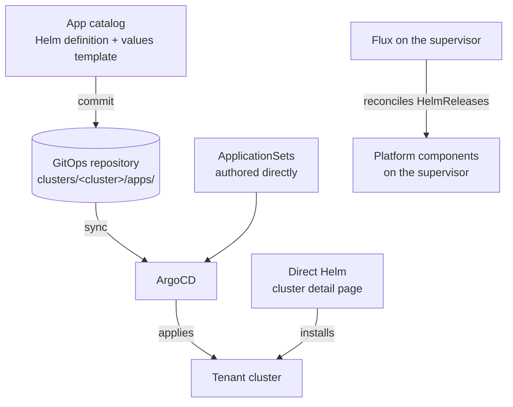

Nothing in Celum installs software by a single mechanism, because "install this on that cluster" means three different things depending on who owns the result. A platform team publishing a curated set of components wants one blueprint reused everywhere. An application team already living in ArgoCD wants their own `Application` objects. Someone debugging a tenant wants Helm, right now, on one cluster. Celum supports all three, and this group explains which is which.

## The three routes



| Route | Use it for | Where it is documented |
| --- | --- | --- |
| **App catalog → Git commit** | A curated component every cluster should be able to get, with per-cluster values — cert-manager, external-dns, an ingress controller, a monitoring agent | [App catalog](/gitops/app-catalog) and [Repositories & manifests](/gitops/repositories-and-manifests) |
| **ArgoCD Applications / ApplicationSets** | Workloads whose lifecycle belongs to an application team, or fan-out patterns ("this app on every cluster matching a generator") | [ArgoCD](/gitops/argocd) |
| **Direct Helm** | One-off installs, upgrades, and rollbacks against a single tenant; debugging | [Day-2 operations](/clusters/day-2-operations#helm-releases) |

The first two are declarative and survive a cluster rebuild — the repository is the record. Direct Helm is imperative and lives only in the cluster's own Helm state, which is exactly why it is the right tool for a fix and the wrong tool for a standard.

## Declared versus running

Two endpoints answer "what is on this cluster", and they deliberately do not agree:

- `GET /api/gitlab/clusters/<cluster>/apps` reads the cluster's `apps/kustomization.yaml` out of the GitOps repository and returns what the committed configuration **declares**, enriched from the app catalog with chart name, version, repo and target namespace.
- `GET /api/clusters/<cluster>/helm-releases` talks Helm through the tenant's own kubeconfig and returns what is **running**.

A declared app missing from the Helm list means ArgoCD has not synced it (or cannot). A running release missing from the declared list was installed outside GitOps — someone's direct Helm install, or a chart another chart pulled in. Neither list is authoritative on its own; the gap between them is the useful signal.

## Where Flux fits

Flux is not the tenant-facing delivery mechanism — ArgoCD is. Flux runs **on the supervisor**, where it reconciles the `HelmRelease` objects behind platform components: the CNI, storage backends, monitoring, cert-manager, the Cluster API stack. Every chart panel in the onboarding wizard is ultimately a Flux HelmRelease, which is why installing Flux is a prerequisite step rather than an option.

Three endpoints cover it:

| Task | Endpoint | Action |
| --- | --- | --- |
| Is Flux installed and healthy? | `GET /api/supervisors/<supervisor>/flux/status` | `supervisor:GetSummary` |
| Install the bootstrap | `POST /api/supervisors/<supervisor>/flux/install` | `supervisor:Onboard` |
| Which Flux version ships with this build | `GET /api/flux/version` | `supervisor:List` |

The status probe is deliberately blunt:

```json
{ "installed": true, "ready": true }
```

`installed: false` means the `flux-system` namespace is absent or unreachable — with a `message` field carrying the reason when it is the latter. `installed: true, ready: false` means the namespace exists but not all three controllers (`source-controller`, `helm-controller`, `kustomize-controller`) report ready. The install is idempotent: re-running it against a healthy supervisor completes in seconds with every resource unchanged.

<Note>
  Tenant clusters have no Flux. That is not an omission — tenants are reconciled by ArgoCD from the repository, or driven directly over Helm. Flux's job stops at the supervisor boundary.
</Note>

## Repositories are the anchor

Everything on the first route needs a Git source. A repository registered under **Settings → Repositories** carries a URL, a branch, a token and a default flag; the default is the repository new clusters commit into. Celum writes to it through GitLab's own API — `repository/tree`, `repository/files`, `repository/commits` — so adding an app to a cluster produces a real commit with a real SHA, reviewable and revertible like any other change.

See [Repositories & manifests](/gitops/repositories-and-manifests) for the file layout and the commit mechanics.

## Permissions

The four families in this group are independent, so you can grant catalog authoring without granting the ability to commit to a cluster, or vice versa:

| Family | Covers | KRN |
| --- | --- | --- |
| `app:*` | The app catalog — `app:List`, `app:Get`, `app:Create`, `app:Update`, `app:Delete`, `app:Render`, `app:HelmCheck`, `app:Import`, `app:Export` | `krn:vks:app:*` |
| `gitlab-app:*` | Per-cluster manifests — `gitlab-app:List`, `gitlab-app:Add`, `gitlab-app:AddPackage`, `gitlab-app:Remove` | `krn:vks:gitlab:<cluster>` |
| `argocd:*` / `argocd-appset:*` | Instance discovery, onboarding, ApplicationSet CRUD | `krn:vks:argocd:*` / `krn:vks:argocd-appset:*` |
| `repository:*` | Git source registration and the default flag | `krn:vks:repository:*` |

Chart discovery reads (`GET /api/charts/versions`, `GET /api/charts/mirror-status`) use `platform:GetDefaults` on `krn:vks:platform:charts`, and ArtifactHub search reuses `app:List`.

## The GitOps pages

<CardGroup cols={2}>
  <Card title="App catalog" icon="box-open" href="/gitops/app-catalog">
    Authoring app definitions — chart source, values template, render preview, chart validation, import and export.
  </Card>

  <Card title="ArgoCD" icon="rotate" href="/gitops/argocd">
    Instance discovery across supervisors, onboarding, Applications and ApplicationSets.
  </Card>

  <Card title="Repositories & manifests" icon="code-commit" href="/gitops/repositories-and-manifests">
    Registering Git sources and how per-cluster app manifests become commits.
  </Card>

  <Card title="Charts & the mirror" icon="magnifying-glass" href="/gitops/charts">
    Finding charts, the platform catalogue's pinned versions, and mirror health.
  </Card>
</CardGroup>

<Note>
  **Celum AI** answers these questions from the same endpoints — `list_apps` for the catalog, `list_cluster_gitops_apps` for what a cluster's repository declares, and `list_argocd` for the ArgoCD inventory.
</Note>
