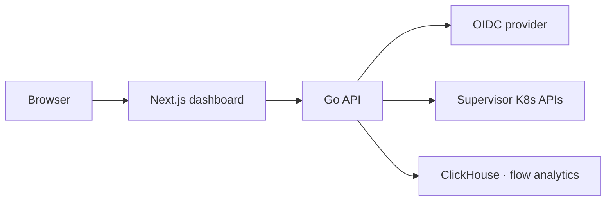

Celum is a single control plane for fleets of Kubernetes clusters. It connects to multiple [Cluster API](https://cluster-api.sigs.k8s.io/) supervisor clusters, shows their tenant clusters and nodes, and drives the full cluster lifecycle — create, edit, and delete — while layering on the operational surface teams actually need day to day: networking, storage, monitoring, network-flow security, and virtual machines.

<Note>
  Celum is **vendor-agnostic**. It detects the infrastructure provider from standard Cluster API objects, so the same dashboard manages vSphere, CloudStack, AWS, Azure, and any CAPI-compliant cluster.
</Note>

## What you can do

<CardGroup cols={2}>
  <Card title="Manage clusters across supervisors" icon="layer-group">
    Switch between supervisor clusters and see every tenant cluster — nodes, IPs, availability zones, readiness, phase, and Kubernetes version at a glance.
  </Card>

  <Card title="Cluster lifecycle" icon="code-branch">
    Create, edit, and delete tenant clusters from reusable templates. Celum renders the configuration, shows you a preview, and applies it.
  </Card>

  <Card title="OIDC auth + IAM" icon="shield-halved">
    Sign in with any OIDC provider (Entra ID and others). AWS-style policies and KRN resources gate every action; all access is audit-logged.
  </Card>

  <Card title="Run virtual machines" icon="server">
    Create, start, stop, and expose KubeVirt VMs with cloud-init, golden-image cloning, and LoadBalancer publication.
  </Card>

  <Card title="Networking & BGP" icon="network-wired">
    Manage LoadBalancer pools, IP allocations, BGP sessions, and shared Gateway / HTTPRoute publication for tenant services.
  </Card>

  <Card title="Security & flow analytics" icon="radar">
    Author Cilium network policies, visualize the live traffic topology, and run flow forensics backed by ClickHouse.
  </Card>
</CardGroup>

## How it works

Celum is a Next.js dashboard backed by a Go API. The backend owns authentication, evaluates IAM policies, and talks to each supervisor's Kubernetes API to read and apply changes.

<Steps>
  <Step title="Authenticate">
    You sign in through your OIDC provider. The backend issues a signed, httpOnly session cookie and resolves your IAM groups.
  </Step>
  <Step title="Pick a supervisor">
    Each kubeconfig Celum is given becomes a named supervisor. Choose one to scope the dashboard to its tenant clusters and resources.
  </Step>
  <Step title="Operate">
    View clusters and nodes, download kubeconfigs and SSH credentials, manage networking/storage/VMs, and author security policies — every mutating action is checked against IAM and recorded in the audit log.
  </Step>
  <Step title="Manage clusters">
    Create, edit, and delete tenant clusters from templates. Celum shows you a preview of the change before it's applied to the supervisor.
  </Step>
</Steps>

## Supported providers

Celum reads only standard Cluster API CRDs, so there are no vendor-specific dependencies. The provider is auto-detected from `spec.infrastructureRef.kind` on each Machine.

| Provider | Machine kind | Status |
| --- | --- | --- |
| VMware vSphere (VKS/TKGs) | `VSphereMachine` | Supported |
| Apache CloudStack (CAPC) | `CloudStackMachine` | Supported |
| AWS (CAPA) | `AWSMachine` | Compatible |
| Azure (CAPZ) | `AzureMachine` | Compatible |
| Any CAPI provider | `*Machine` | Compatible |

## Next steps

<CardGroup cols={2}>
  <Card title="Quickstart" icon="rocket" href="/get-started/quickstart">
    Connect your first supervisor and explore the dashboard.
  </Card>

  <Card title="Authentication & IAM" icon="key" href="/get-started/authentication">
    Configure OIDC and map provider groups to IAM policies.
  </Card>

  <Card title="Create a cluster" icon="circle-plus" href="/clusters/create">
    Provision a tenant cluster from a reusable template.
  </Card>

  <Card title="Architecture" icon="sitemap" href="/concepts/architecture">
    How the dashboard, API, supervisors, and GitLab fit together.
  </Card>
</CardGroup>