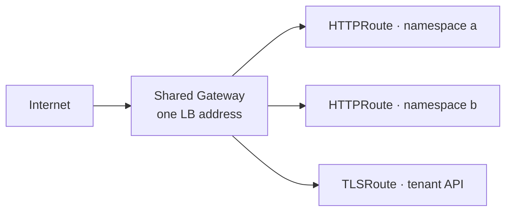

The **Gateways & Routes** tab manages the north-south path: Gateway API objects, their listeners and certificates, and the routes that publish workloads through them. Which controller serves them — Envoy Gateway or Cilium Gateway API — is shown by the north-south engine pill in the page header. If the pill flags a **conflict**, both stacks' CRDs are installed at once; resolve that before creating gateways, or two controllers will fight over the same objects.

## The shared gateway pattern

Celum's ingress model is built on **one Gateway, many namespaces**. A shared Gateway holds a single LoadBalancer address; every listener on it allows routes from all namespaces, so an HTTPRoute anywhere in the cluster can attach to it cross-namespace. cert-manager's Gateway API integration issues TLS certificates straight from the Gateway's annotations.

The result: services and tenant APIs are published without consuming a LoadBalancer address each, and certificates renew without anyone touching a Secret.

## The Gateways table

Each row shows the gateway's class chip, its address, the hostnames it serves, and its ready state. Gateways created by Celum are fully editable; gateways created outside it are listed read-only — edit those through their own tooling.

### Create a gateway

**Add gateway** asks for a name, a namespace, and optionally a **requested IP** — a specific address from a LoadBalancer pool instead of whatever the pool hands out next. You can change the address later from the row's actions. With no listeners specified, the gateway starts with a single HTTP listener on port 80; add more with the listener editor.

## Listeners

The listener editor manages the gateway's listeners — each is a name, protocol, port, and optional hostname:

<Tabs>
  <Tab title="HTTP">
    Plain HTTP. Typically kept on port 80 for the automatic HTTPS redirect that route publication creates.
  </Tab>
  <Tab title="HTTPS">
    TLS terminated at the gateway. The certificate comes from one of two places:

    - **An existing Secret** — pick any TLS Secret in the gateway's namespace.
    - **A cert-manager ClusterIssuer** — name the issuer and a hostname, and cert-manager issues and renews the certificate into an auto-named Secret. This is the zero-maintenance path.

    Issuer mode requires a hostname, because certificates are issued per hostname.
  </Tab>
  <Tab title="TLS passthrough">
    TLS is **not** terminated — encrypted traffic is forwarded to the backend based on the SNI hostname. This is how tenant Kubernetes APIs are published, since their clients must see the API server's own certificate.
  </Tab>
</Tabs>

<Note>
  One ClusterIssuer per gateway: the issuer rides a Gateway-level annotation, so all issuer-mode listeners on a gateway share it.
</Note>

<Warning>
  Listener names starting with `tls-` are reserved for tenant-API publications. The editor refuses them, and editing listeners never touches the reserved ones — so an operator edit can never silently unpublish a tenant API.
</Warning>

## Datapath modes

On Envoy-class gateways, each gateway can choose how its proxy runs — the switch actually reconfigures the underlying Envoy proxy deployment:

| Mode | How it runs | Choose it when |
| --- | --- | --- |
| Cluster | A shared proxy Deployment | The default — fine for most gateways |
| Daemonset | One proxy pod per node | High-traffic gateways that should scale with the node count and skip the extra hop |

Switching mode rolls the proxy; expect a brief connection blip on that gateway.

## Routes

One table lists every route — HTTP and TLS — with its hostname, backend, parent gateway, and whether the gateway controller **accepted** it. An unaccepted route serves nothing; the row carries the controller's message explaining why.

### Publish a service

**Publish service** creates an HTTPRoute through a shared gateway:

<Steps>
  <Step title="Pick the service">
    Choose the namespace and Service to publish.
  </Step>
  <Step title="Accept or edit the hostname">
    Celum suggests a hostname from the supervisor's configured domain — for example `myservice.<supervisor-domain>`.
  </Step>
  <Step title="Pick the gateway and issuer">
    Choose which shared gateway carries the route and, for HTTPS, the ClusterIssuer for its certificate.
  </Step>
</Steps>

An HTTP-to-HTTPS redirect (301) is created alongside the route automatically, so the plain-HTTP hostname never serves content.

### Publish a tenant cluster's API

**Publish tenant API** exposes a tenant cluster's Kubernetes API through the shared gateway using TLS passthrough:

- A passthrough listener for the chosen hostname is appended to the gateway (with the reserved `tls-` name prefix).
- A TLSRoute forwards matching SNI traffic to the tenant's API server Service.
- The hostname is appended to the tenant API server certificate's SANs, so `kubectl` trusts the published endpoint.

Unpublishing removes the route and its listener again. The table shows each published API's accepted state — if it stays unaccepted with no controller status, the gateway controller may not watch TLSRoutes at all (Cilium's Gateway API needs its alpha feature set for that).

<Note>
  Individual VM ports can also be published through a gateway. That flow lives with the VM — see [VM networking](/vms/networking#publishing-through-a-gateway).
</Note>

## Permissions

| Task | Action |
| --- | --- |
| List gateways, listeners, TLS secrets, routes | `gateway:List` |
| Create or update a gateway, listener, datapath, or route; publish | `gateway:Create` |
| Delete a gateway or route; unpublish | `gateway:Delete` |

All are scoped to `krn:vks:supervisor:<supervisor>:gateway:*`.

## Related

<CardGroup cols={2}>
  <Card title="VM networking" icon="network-wired" href="/vms/networking">
    Publishing a single VM's ports — LoadBalancer or gateway.
  </Card>

  <Card title="Pools & IPAM" icon="chart-pie" href="/networking/pools-and-ipam">
    Where a gateway's LoadBalancer address comes from.
  </Card>

  <Card title="BGP & Egress" icon="route" href="/networking/bgp-and-egress">
    How the gateway's address is advertised to the fabric.
  </Card>

  <Card title="Networking overview" icon="network-wired" href="/networking/overview">
    The north-south engine and the rest of the model.
  </Card>
</CardGroup>
