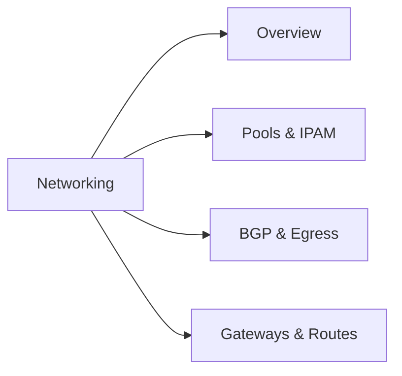

Every supervisor's network is driven by three engines. Onboarding installs and configures them; the **Networking** page shows their state and the objects they manage. Open it at **Supervisors → your supervisor → Networking**.

| Engine | What it does | Implementations |
| --- | --- | --- |
| CNI | Pod networking, LoadBalancer IPAM, network policy | Cilium |
| BGP engine | Advertises pod, LoadBalancer, and egress prefixes to the fabric | FRR-K8s, legacy FRR, Cilium BGP control plane |
| North-south engine | Terminates inbound traffic — Gateways, listeners, routes | Envoy Gateway, Cilium Gateway API |

The page header carries two **engine pills**: one for the BGP engine and one for the north-south engine. They tell you at a glance which implementation this supervisor runs — the BGP and gateway views adapt to whichever engine is active, so the same tabs work on every supervisor.

The north-south pill also carries a **conflict** alert when both gateway stacks' CRDs are present on the cluster at once. Resolve that before creating gateways — two controllers competing for the same objects is undefined behavior. On a healthy supervisor exactly one engine reports present: Envoy Gateway with Cilium's Gateway API off, or the reverse.

<Note>
  Networking is **per-supervisor**. Each supervisor has its own engines, pools, and gateways; nothing on this page spans supervisors.
</Note>

## The four tabs

<CardGroup cols={2}>
  <Card title="Pools & IPAM" icon="chart-pie" href="/networking/pools-and-ipam">
    Every IP pool in one table — LoadBalancer, VM identity, and Pod IP — with utilization, conflicts, and allocations.
  </Card>

  <Card title="BGP & Egress" icon="route" href="/networking/bgp-and-egress">
    Per-node BGP sessions, the advertise table with drift detection, and everything egress: candidate nodes, HA, policies.
  </Card>

  <Card title="Gateways & Routes" icon="globe" href="/networking/gateways-and-routes">
    Shared Gateways, listeners and TLS, datapath modes, routes, and publishing services or tenant APIs.
  </Card>

  <Card title="VM identity pools" icon="id-card" href="/networking/vm-identity-pools">
    Stable addresses that follow a VM through live migration — managed as a pool kind of their own.
  </Card>
</CardGroup>

## The Overview tab

The first tab is a live engine dashboard — everything on it is read from the supervisor, nothing is static:

| Element | What it shows |
| --- | --- |
| Four KPIs | BGP sessions, LoadBalancer pool utilization, gateway and route counts, egress state |
| Engines card | The CNI, BGP, and north-south engines with their current state and a **Manage** link into the tab that owns each |
| Advertise snapshot | A live excerpt of the BGP advertise table, including drift detection |

The advertise snapshot is the fastest health check on the page: if a prefix you expect to be advertised shows as missing — or one you turned off is still being advertised — the [BGP & Egress](/networking/bgp-and-egress) tab has the full table and the diagnostics.

## Networking and onboarding

Onboarding is where engines are chosen and installed — Cilium as the CNI, a BGP engine, a north-south engine. The Networking page never installs an engine; it manages the objects those engines act on. If an engine is absent, its card on the Overview tab says so and links back to the installation step.

## Networking and projects

The other half of the story is **projects**: per-tenant networking — a LoadBalancer slice, egress identity, traffic isolation, advertise selections — is configured on the project, not here. The Networking page shows and operates the objects those intents materialize as: project pools in Pools & IPAM, read-only egress policies in BGP & Egress, project-sourced advertise rows. [Project networking](/networking/project-networking) maps the two sides onto each other.

## Permissions

Networking reads and writes map to two action families:

| Task | Action | KRN |
| --- | --- | --- |
| Read pools, BGP state, egress, allocations | `cilium:GetState` | `krn:vks:supervisor:<supervisor>:cilium:*` |
| Create, update, or delete pools, egress, BGP config | `cilium:Apply` | `krn:vks:supervisor:<supervisor>:cilium:*` |
| List gateways, listeners, TLS secrets, routes | `gateway:List` | `krn:vks:supervisor:<supervisor>:gateway:*` |
| Create or update gateways and routes | `gateway:Create` | `krn:vks:supervisor:<supervisor>:gateway:*` |
| Delete gateways and routes | `gateway:Delete` | `krn:vks:supervisor:<supervisor>:gateway:*` |

## Related

<CardGroup cols={2}>
  <Card title="Supervisors & clusters" icon="layer-group" href="/concepts/supervisors-and-clusters">
    What a supervisor is and how it is addressed.
  </Card>

  <Card title="Project networking" icon="diagram-project" href="/networking/project-networking">
    Per-tenant intent — slices, egress, isolation — and the objects it materializes as.
  </Card>

  <Card title="VM networking" icon="network-wired" href="/vms/networking">
    Publishing individual VMs — the consumer side of pools and gateways.
  </Card>

  <Card title="Permissions model" icon="shield-halved" href="/concepts/permissions-model">
    How actions and KRNs gate every call on this page.
  </Card>
</CardGroup>
