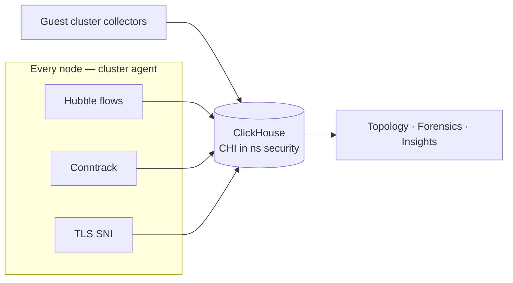

Every flow view in Celum — traffic topology, forensics, policy insights — is a query against **ClickHouse** on the supervisor, fed continuously by the **flow pipeline**. Both are components with their own status, and this page exists mostly for one lesson: when a flow view is empty, **check freshness before components** — the pipeline's most deceptive failure mode is every component green while ingestion is stalled.

## The ingestion path

Three pieces, three statuses:

| Piece | What it is | Status shows |
| --- | --- | --- |
| **ClickHouse operator** | Altinity operator (chart e.g. `0.27.1`, namespace `clickhouse-system`) managing the database | HelmRelease state, plus the **CHI** (ClickHouse installation) name, phase, and pod count — healthy is `Completed` |
| **Schema chart** | A Helm chart (e.g. `clickhouse-schema@1.0.10`, namespace `security`) that ships the table definitions as a ConfigMap and applies them | Release state, ConfigMap presence and hash, and `tablesPresent` vs `tablesExpected` (e.g. `7/7`) with an `applied` flag |
| **Collectors** | Per-node dispatchers inside the cluster agent DaemonSet, one per telemetry kind — Hubble flows, conntrack, TLS SNI, Tetragon | DaemonSet readiness (e.g. `3/3`), which dispatchers are enabled, and the ClickHouse DSN host they write to (e.g. `clickhouse-hubble-flows.security.svc:9000`) |

Guest clusters run their own collectors pointed at the same supervisor ClickHouse, so one database holds flows for the supervisor and every guest — each row tagged with its cluster name.

The pipeline status also reports **per-table row counts** (cumulative totals per output table) for `flows_local`, `ct_flows_1m_local`, `tls_sni_1m_local`, and `ext_ips_fqdn_local`. A disabled dispatcher reads as a hard zero (e.g. `tetragon_syscalls_1m_local: 0` with the Tetragon dispatcher off) — expected, not a fault. A zero on a table whose dispatcher is **enabled** is the fault.

<Note>
  DNS enrichment is part of the pipeline: a cluster-wide DNS visibility policy feeds the `ext_ips_fqdn_local` table, which maps external IPs to hostnames in flow views. The pipeline status reports whether that policy is present.
</Note>

## Freshness — the first check

The freshness endpoint reports, per cluster writing into ClickHouse, the timestamp of the **most recent flow row** and its age:

| Cluster | Kind | Last flow | Age | Status |
| --- | --- | --- | --- | --- |
| `<supervisor>` | supervisor | `2026-08-16T07:29:38Z` | 9 s | `ok` |
| `guest-1` | guest | `2026-08-16T07:29:41Z` | 6 s | `ok` |
| `guest-2` | guest | `2026-08-16T07:29:39Z` | 8 s | `ok` |

A cluster goes `stale` when its newest row is older than the threshold (`staleAfterSeconds`, 900 by default). Single-digit ages are normal on an active cluster; ages climbing toward the threshold mean ingestion for that cluster has stopped.

<Warning>
  **Empty dashboards, green components** is a real incident class, not a hypothetical: every HelmRelease ready, every pod running — and no data, because the collectors could not reach or resolve the ClickHouse write endpoint. Component status cannot see that; only freshness can. If a flow view is empty, read freshness *first* and only then start on components.
</Warning>

### Triage order

<Steps>
  <Step title="Freshness">
    Which clusters are stale? All of them points at ClickHouse or the write path; one guest points at that guest's collectors or its network path to the supervisor.
  </Step>
  <Step title="Ingestion rates">
    In the pipeline status, check the per-table row counts. A zero on an enabled dispatcher's table narrows the fault to that telemetry kind; for **is it ingesting right now**, freshness (above) is the authoritative signal, not the counts.
  </Step>
  <Step title="Pipeline runtime">
    Collector DaemonSet ready count, enabled dispatchers, and the DSN host. A DSN the collectors cannot resolve or connect to stalls everything while every release stays green.
  </Step>
  <Step title="Components">
    Only now the HelmReleases: operator ready, CHI `Completed`, schema applied with `tablesPresent` = `tablesExpected`. A schema mismatch after an upgrade blocks inserts into the missing tables.
  </Step>
</Steps>

## Schema chart versioning

The table schema is versioned and shipped as its own chart, independent of the operator: bumping the schema chart rolls out new tables and views without touching ClickHouse itself. The status pins the exact applied version (e.g. `clickhouse-schema@1.0.10`) and the hash of the schema ConfigMap, so "which schema is this supervisor on" is always answerable. After a schema upgrade, `tablesPresent` vs `tablesExpected` confirms the migration completed.

## Ingestion counters

The security flows status complements freshness with volume: rows written in the last minute and hour, and policy denials in the last hour — a quick sanity check that volumes look plausible for the environment. It also lists which conntrack **trace reasons** are recorded (default `NEW`, `REPLY`) out of the available choices; widening this increases row volume accordingly.

## Permissions

| Task | Action | KRN |
| --- | --- | --- |
| Read ClickHouse / flow-pipeline status | `monitoring:GetStatus` | `krn:vks:supervisor:<supervisor>:monitoring:*` |
| Install ClickHouse, apply the CHI, configure the pipeline | `monitoring:Install` | `krn:vks:supervisor:<supervisor>:monitoring:*` |
| Read flow ingestion status and freshness | `supervisor:GetSummary` | `krn:vks:supervisor:<supervisor>` |

## Related

<CardGroup cols={2}>
  <Card title="Platform health overview" icon="heart-pulse" href="/platform-health/overview">
    Why data freshness is the fourth layer of the triage model.
  </Card>

  <Card title="Monitoring" icon="chart-line" href="/platform-health/monitoring">
    Metrics — the other telemetry pipeline, with its own store.
  </Card>

  <Card title="Logs" icon="file-lines" href="/platform-health/logs">
    Loki and Alloy — same green-but-empty failure shape, different pipeline.
  </Card>

  <Card title="Networking overview" icon="network-wired" href="/networking/overview">
    The Cilium datapath the flow telemetry observes.
  </Card>
</CardGroup>
