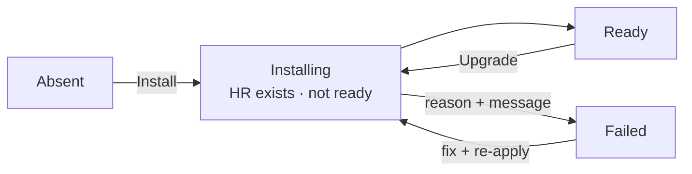

Every platform component Celum installs on a supervisor — the CNI, cert-manager, the monitoring stack, Loki, ClickHouse, CAPI, KubeVirt, storage operators, and the rest — is tracked the same way: a **status endpoint per component family** that reports whether the component is installed, whether it is ready, which version is running, and *why* if it is not. Learn the model once and every health panel in the product reads the same.


## The status model

Components are installed as Flux **HelmReleases**. Each component's status endpoint returns a `helmRelease` block read straight from the release object on the supervisor:

| Field | Meaning |
| --- | --- |
| `exists` | The HelmRelease object is present — the component has been installed (or an install was attempted) |
| `ready` | The release's `Ready` condition is `True` |
| `revision` | The chart version currently deployed |
| `lastAttemptedRevision` | The chart version of the last reconcile attempt — differs from `revision` while an upgrade is in flight or failing |
| `conditions` | The release conditions, each with `type`, `status`, `reason`, and `message` |

A healthy monitoring stack looks like this:

```json
"helmRelease": {
  "exists": true,
  "ready": true,
  "revision": "86.2.3",
  "lastAttemptedRevision": "86.2.3",
  "conditions": [
    {
      "type": "Ready",
      "status": "True",
      "reason": "UpgradeSucceeded",
      "message": "Helm upgrade succeeded for release monitoring/kube-prometheus-stack.v90 with chart kube-prometheus-stack@86.2.3"
    }
  ]
}
```

The `reason` and `message` are the diagnostic. When a release is not ready, the same block carries the chart controller's explanation — a failed hook, a values error, an unreachable chart repository — verbatim. Every install panel in the UI renders it, so you rarely need `kubectl` to find out why a component is stuck.

## Install → ready lifecycle



The onboarding wizard maps this lifecycle onto its step states: a step is **locked** until its dependencies are ready, **ready** when it can be installed, **running** while the HelmRelease exists but is not yet ready, and **done** once the release reports `Ready`. The same derivation drives the installation summary in the wizard sidebar, so the stepper reflects real cluster state on page load — not what you clicked last.

## Where statuses surface

- **Onboarding wizard** — each install step shows the component's chart panel: available versions with the pinned default marked, the installed version, an automatic "Upgrade to X" action when the picked version differs, a re-apply button, and the release's `Ready` condition with reason and message as the footer.
- **Day-2 panels** — the supervisor's Networking, Storage, Monitoring, Security, and Virtualization surfaces re-read the same status endpoints, so component state on a tab always matches what the wizard would show.

<Note>
  The in-product assistant, **Celum AI**, answers health questions from these same status APIs — asking "is monitoring healthy on this supervisor?" reads the identical data the panels render.
</Note>

## Release state is not the whole story

A green HelmRelease means the chart deployed. It does **not** mean the workloads are running, and it does not mean data is flowing. Triage in this order:

<Steps>
  <Step title="Release state">
    Is the HelmRelease ready? If not, read the `Ready` condition's reason and message — this resolves most install and upgrade failures without leaving the UI.
  </Step>
  <Step title="Version drift">
    Does `revision` match the desired chart version? A `lastAttemptedRevision` ahead of `revision` means an upgrade is stuck — the conditions say why.
  </Step>
  <Step title="Runtime state">
    Are the component's workloads actually up? Status endpoints report runtime signals beyond the release: DaemonSet readiness for collectors, ClickHouse instance state, discovered ServiceMonitors. A release can be `Ready` while a restrictive namespace policy leaves a DaemonSet at zero pods — see [Logs](/platform-health/logs) for the classic case.
  </Step>
  <Step title="Data freshness">
    For telemetry components, check that data is *arriving*, not just that components are green. Empty flow dashboards with every component healthy almost always means stalled ingestion — [Flow telemetry](/platform-health/flow-telemetry) makes freshness the first check.
  </Step>
</Steps>

## Component families

| Family | Components | Status read action |
| --- | --- | --- |
| CNI & BGP | Cilium, FRR-K8s, north-south engine | `cilium:GetState` |
| Gateways | Envoy Gateway | `gateway:List` |
| Certificates | cert-manager | `certs:GetStatus` |
| Monitoring & telemetry | kube-prometheus-stack, Loki, Alloy, ClickHouse, flow pipeline | `monitoring:GetStatus` |
| Storage | Rook/Ceph, NFS, FC | `storage:GetStatus`, `ceph:GetStatus` |
| Virtualization | KubeVirt, snapshot controller | `virt:GetStatus` |
| Cluster lifecycle | CAPI core, CAPI add-ons, vcluster | `capi:GetStatus`, `vcluster:GetStatus` |
| Secrets | external-secrets | `secrets:GetStatus` |
| Platform plumbing | Flux bootstrap, cluster agent, security stack, Tetragon | `supervisor:GetSummary` |

All actions are scoped to the supervisor, e.g. `krn:vks:supervisor:<supervisor>:monitoring:*` for the monitoring family and `krn:vks:supervisor:<supervisor>` for `supervisor:GetSummary`.

Networking engine health — BGP sessions, advertise drift, gateway conflicts — has its own dedicated surface; see the [Networking overview](/networking/overview).

## Related

<CardGroup cols={2}>
  <Card title="Monitoring" icon="chart-line" href="/platform-health/monitoring">
    The Prometheus stack — install state, ServiceMonitors, and opt-in exporters.
  </Card>

  <Card title="Logs" icon="file-lines" href="/platform-health/logs">
    Loki and the Alloy collectors — release state vs runtime state.
  </Card>

  <Card title="Flow telemetry" icon="wave-square" href="/platform-health/flow-telemetry">
    ClickHouse, the flow pipeline, and freshness — the ingestion-first triage.
  </Card>

  <Card title="Infrastructure & nodes" icon="server" href="/platform-health/infrastructure">
    Node boards — capacity, disks, NICs, GPUs, and power profiles.
  </Card>
</CardGroup>
