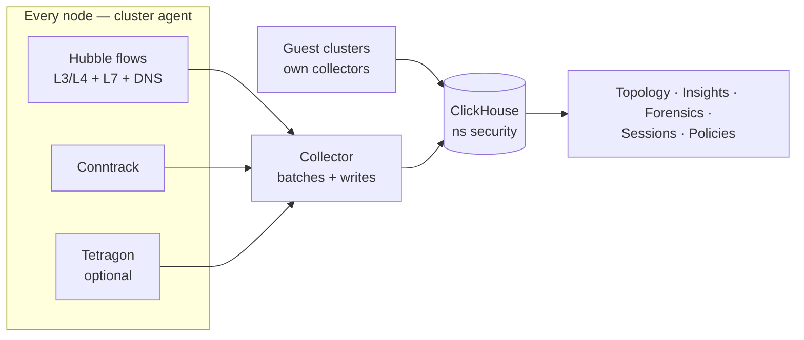

Security in Celum is not a separate product bolted onto the cluster — it is a set of questions asked of one store. Every node on a supervisor observes its own traffic, ships it to a ClickHouse database on that supervisor, and each Security tab is a differently shaped query over the same rows. Open it at **Supervisors → your supervisor → Security**.

That single origin is what makes the tabs consistent: a workload that appears as a node on the topology graph is the same row that Insights counts and Forensics drills into, so a number never disagrees with the picture next to it.

## What feeds the store



Four properties of that picture matter operationally:

- **One database per supervisor.** Guest clusters and vclusters write into the *supervisor's* ClickHouse, each row tagged with the cluster it came from. That is why every Security view has a cluster selector rather than making you switch supervisors to see a tenant.
- **Hubble supplies verdicts, conntrack supplies volume.** A flow's allow/deny decision comes from Cilium; byte counts largely come from conntrack aggregation. Some edges therefore have one and not the other — [edge quality](/security/flow-analytics#edge-quality) puts a number on how much of the graph has both.
- **DNS enrichment is a policy, not a component.** A cluster-wide DNS visibility policy makes Cilium's L7 DNS proxy emit lookups; without it external peers stay bare IPs forever while every other part of the stack looks healthy.
- **Tetragon is optional.** Process-level events only exist if you installed it — see [Pipeline & runtime](/security/pipeline-and-runtime#tetragon).

The install and health side of that pipeline is documented in [Flow telemetry](/platform-health/flow-telemetry); this group is about using what it produces.

## The tabs

| Tab | The question it answers |
| --- | --- |
| **Topology** | Who talks to whom, on which ports, and is that edge covered by a policy? Also the authoring surface — the same graph in `?mode=author`. |
| **Sessions** | Which workload pairs hold the most conversations right now, filtered by Cilium labels? |
| **Flow Visibility** | Aggregate shape of traffic — summary counters, namespace-to-namespace chords, byte-heavy pairs. |
| **Insights** | Where does egress go, what L7 dominates, how much traffic is actually policy-protected? |
| **Ingress Forensics** | Who is reaching this service, from which IP, with how many errors? |
| **Egress Forensics** | Where does this workload phone home, and how much of it is being dropped? |
| **Secrets** | Platform-managed secrets and their sync state. Shown only where External Secrets Operator is installed. |
| **Flow Collector** | The pipeline itself: enable collection, Tetragon, lifecycle. |

Network policy *listing* lives on **Networking → Network Policies**; policy *authoring* lives on the Topology tab in author mode. Both drive the same API — see [Network policies](/security/policies).

## The window model

Every read takes a `since` parameter — a duration such as `15m`, `1h`, `24h`, defaulting to `1h`. Forensics adds `offset`, which shifts the whole window backwards: `since=1h&offset=2h` reads the hour that ended two hours ago. That pair is what turns forensics from a live dashboard into an incident replay — set the window to the length of the incident, then walk `offset` backwards until the anomaly appears.

Widening `since` costs query time, not accuracy. If a view is slow on a busy supervisor, narrow the window before narrowing the data.

## No data or no traffic?

This is the first fork in every Security investigation, and the tabs cannot tell you on their own — an empty topology graph looks identical whether nothing talked or nothing was recorded. Two endpoints settle it.

**Ingestion counters** (`GET /api/supervisors/<supervisor>/security/flows/status`) say whether rows are arriving at all:

```json
{
  "enabled": true,
  "schemaReady": true,
  "counts": { "rowsLastMinute": 20188, "rowsLastHour": 1311909, "denialsLastHour": 28747 },
  "dnsVisibilityApplied": true,
  "traceReasons": ["NEW", "REPLY"]
}
```

**Freshness** (`GET /api/supervisors/<supervisor>/security/flows/freshness`) breaks that down per writing cluster — the supervisor plus every guest:

```json
{
  "entries": [
    { "cluster": "<supervisor>", "kind": "supervisor", "lastFlow": "2026-08-16T16:26:08Z", "ageSeconds": 3, "status": "ok" },
    { "cluster": "demo-cl",      "kind": "guest",      "lastFlow": "2026-08-16T16:26:11Z", "ageSeconds": 0, "status": "ok" },
    { "cluster": "demo-cl-2",    "kind": "guest",      "lastFlow": "2026-08-16T16:26:10Z", "ageSeconds": 2, "status": "ok" }
  ],
  "staleAfterSeconds": 900
}
```

Read them in that order:

<Steps>
  <Step title="Is anything arriving?">
    `rowsLastMinute` at zero on an active supervisor means ingestion is stopped, not that the network is quiet. Nothing else on the page is trustworthy until that is fixed.
  </Step>
  <Step title="Which cluster stopped?">
    Single-digit `ageSeconds` is normal. One guest climbing toward `staleAfterSeconds` (900 by default) points at that guest's collectors or its path to the supervisor; every entry climbing points at ClickHouse or the write path.
  </Step>
  <Step title="Only then blame the query">
    With fresh rows for the cluster you selected, an empty view really is an empty result — wrong namespace, wrong window, or genuinely no traffic.
  </Step>
</Steps>

<Warning>
  Every component green with no data is a real failure mode, not a hypothetical. HelmReleases and pods cannot see a collector that fails to reach the write endpoint; only freshness can. Check freshness before you check components.
</Warning>

Two more counters are worth knowing. `denialsLastHour` gives a sense of whether policy enforcement is doing anything at all, and `traceReasons` shows which conntrack trace reasons are being recorded — the default `NEW`, `REPLY` pair deliberately excludes `ESTABLISHED`, so long-lived connections are counted at setup rather than continuously.

## Permissions

Almost every Security read maps to one action:

| Task | Action | KRN |
| --- | --- | --- |
| Read topology, analytics, forensics, policies, drift, coverage, identities, secrets list, status | `supervisor:GetSummary` | `krn:vks:supervisor:<supervisor>` |
| Dry-run a policy | `supervisor:GetSummary` | `krn:vks:supervisor:<supervisor>` |
| Create, update, or delete a policy; create a platform secret | `supervisor:Manage` | `krn:vks:supervisor:<supervisor>` |
| Install or operate the pipeline, Tetragon, ClickHouse instances, force-cleanup | `supervisor:Onboard` | `krn:vks:supervisor:<supervisor>` |
| Promote a VM onto the shared Gateway from Ingress Forensics | `vm:Expose` | `krn:vks:supervisor:<supervisor>:vm:*` |

<Warning>
  Read access to Security is coarser than most people expect. `supervisor:GetSummary` is the same action that gates a supervisor's overview page, and it grants **every** flow view: full topology, L7 URLs, client IPs, and the label sets behind workload identities across all namespaces. There is no per-namespace read scope. Grant it deliberately.
</Warning>

## The Security pages

<CardGroup cols={2}>
  <Card title="Topology" icon="circle-nodes" href="/security/topology">
    The graph — nodes with listening ports, edges with verdict and policy coverage, and the coverage caveats.
  </Card>

  <Card title="Flow analytics" icon="chart-simple" href="/security/flow-analytics">
    Namespace chords, FQDN egress, L7 and DNS breakdowns, policy effectiveness, edge quality.
  </Card>

  <Card title="Forensics" icon="magnifying-glass-chart" href="/security/forensics">
    Ingress and egress drill-down to one client IP or one workload, with window replay.
  </Card>

  <Card title="Network policies" icon="file-shield" href="/security/policies">
    Dry-run, apply, coverage, drift, and per-policy detail.
  </Card>

  <Card title="Pipeline & runtime" icon="radio" href="/security/pipeline-and-runtime">
    Installing and operating the collector, guests and vclusters, Tetragon, cleanup.
  </Card>

  <Card title="Flow telemetry" icon="wave-square" href="/platform-health/flow-telemetry">
    The health model for ClickHouse and the ingestion path itself.
  </Card>
</CardGroup>

<Note>
  Celum AI answers these questions from the same endpoints. `get_flow_freshness` tells it whether telemetry is alive, `get_component_status` whether the pipeline components are installed, and `get_flow_topology` gives it the map to reason over.
</Note>
