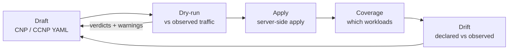

Celum treats a network policy as something you can *check before you mean it*. The flow store already knows every conversation the selected workload had in the last hour, so a draft policy can be evaluated against real traffic before it reaches the apiserver — which is the difference between "this looks right" and "this would have broken these 14 edges".

Two surfaces, one API. The policy **list** lives on **Networking → Network Policies**; **authoring** happens on **Security → Topology** in author mode (`?mode=author`), where the graph you are reasoning about is the same graph the policy will act on. Both call the endpoints below.

## The loop



<Steps>
  <Step title="Draft">
    Build the policy from the graph — pick a workload, pick the edges you want to keep, and the editor renders CNP or CCNP YAML. The [applications](/security/flow-analytics#applications) endpoint backs the picker so you can select a logical app rather than enumerating pods.
  </Step>
  <Step title="Dry-run">
    `POST .../security/policies/dry-run` scores the draft against the window's real edges. Nothing is applied.
  </Step>
  <Step title="Apply">
    `POST .../security/policies` writes it. Enforcement is immediate — the moment the apiserver accepts the object, Cilium acts on it.
  </Step>
  <Step title="Verify">
    Coverage says which workloads the policy now selects; flow matches proves it is matching real traffic; the topology graph repaints those edges as `policy-protected`.
  </Step>
  <Step title="Watch for drift">
    Drift compares what policies declare against what the network actually did, and is the thing to check after any change to labels or workloads.
  </Step>
</Steps>

## Dry-run

The request carries the draft YAML, the workload you are reasoning about, and the window to score against:

```json
{
  "yaml": "apiVersion: cilium.io/v2\nkind: CiliumNetworkPolicy\n...",
  "affectedNamespace": "proj-demo",
  "affectedWorkload": "api-frontend",
  "sinceSeconds": 3600
}
```

The response sorts every observed edge into three buckets — `wouldAllow` (matched by the selector and permitted by a rule), `wouldDeny` (matched but no rule fits), and `unaffected` (the selector does not match) — each edge carrying direction, peer, port, protocol, bytes and its current `observedAction`. A `summary` reports `edgesAnalysed` and whether the policy acts on ingress, egress or both.

Two response fields matter more than the buckets:

- `parseError` is set while the YAML is incomplete. The editor polls as you type, so a half-written policy returns a hint rather than an error, and the verdict lists stay empty.
- `warnings` surface blast radius that per-edge verdicts cannot. Each has a `severity` of `warn` or `danger`, a title, detail, and the notable workloads involved.

<Warning>
  The warning to never dismiss is the whole-namespace one. A CiliumNetworkPolicy with an **empty `endpointSelector`** selects every pod in the namespace, which turns it into a default-deny for workloads you never considered. This has taken down guest-cluster control planes that happened to share a namespace with the workload being secured. If dry-run raises it at `danger`, scope the selector before you apply.
</Warning>

Dry-run is a read as far as authorization is concerned — it runs under `supervisor:GetSummary`, so anyone who can look at flows can evaluate a draft without being able to apply it.

## Apply and delete

`POST .../security/policies` takes `namespace`, `name` and `yaml`. Semantics worth being explicit about:

- **Replace, not merge.** The YAML in the body *is* the new state of the object. There is no merge with what is live, so a field you removed from the draft is removed from the cluster.
- **Server-side apply with a stable field manager**, so repeated applies update in place and Cilium's own `managedFields` keep the change attributable alongside the platform's audit log.
- **Two kinds only.** `CiliumNetworkPolicy` and `CiliumClusterwideNetworkPolicy` are accepted; anything else is rejected rather than silently widening what this endpoint can write.
- **CCNP is expressed by an empty namespace** (the UI sends the placeholder `cluster`).

`DELETE .../security/policies?name=<name>&namespace=<namespace>` removes one, with the same empty-namespace convention for cluster-wide policies. Both writes require `supervisor:Manage`.

## Coverage

`GET .../security/policies/coverage` returns the map from workload to the policies covering it — name, namespace and kind, so a namespaced CNP is distinguishable from a cluster-wide CCNP at a glance. This is the same index the topology graph uses to paint an edge `policy-protected` instead of `unprotected`, and the same one that fills `coveredBy` on a node.

## Drift

`GET .../security/policies/drift` compares what policies *declare* against what the datapath *did*, over the analysis window:

```json
{
  "policiesChecked": 13,
  "edgesAnalysed": 361,
  "windowSeconds": 3600,
  "drifts": [
    {
      "policyName": "guest-access-demo-cl", "policyNamespace": "proj-demo", "policyKind": "CiliumNetworkPolicy",
      "affectedNamespace": "proj-demo", "affectedWorkload": "worker-0",
      "direction": "ingress", "peerNamespace": "proj-demo", "peerWorkload": "control-plane-0",
      "destPort": 10250, "protocol": "TCP", "bytes": 593050,
      "declaredVerdict": "deny", "observedAction": "allow",
      "driftType": "policy-blocks-cilium-allows"
    }
  ]
}
```

`policiesChecked` and `edgesAnalysed` are the reason to trust an empty result: zero drifts with 13 policies and 361 edges analysed means the policies agree with reality, whereas zero drifts with `edgesAnalysed: 0` means nothing was compared and you should be looking at [freshness](/security/overview#no-data-or-no-traffic) instead.

The common `driftType` is `policy-blocks-cilium-allows` — the policy's rules would deny an edge that was observed as `allow` or `unprotected`. Nine times out of ten that is the coverage gap below rather than a broken datapath: the policy is correct, but the workload is not being recognized as one it selects.

## Per-policy detail

Four endpoints answer "what does this specific policy do", all keyed by `name` plus `namespace` (empty or `cluster` for a CCNP):

| Endpoint | Answers |
| --- | --- |
| `security/policy` | The policy object as applied |
| `security/policy/affected-workloads` | What its selector actually matches. Accepts `kind=` — including `NetworkPolicy` for a `networking.k8s.io/v1` object |
| `security/policy/flow-matches` | How many real flows it matched in the window — `matched`, `windowSeconds`, `available` |
| `security/policy/history` | Its revisions, reconstructed from the platform audit log |

`flow-matches` is the proof-of-life check: a policy with `matched: 0` over a busy window either selects nothing or guards a path nobody uses. `history` reads the audit log, so it requires the platform database to be configured and only covers changes made *through* Celum — a `kubectl apply` by hand will not appear.

## Identities — what selectors actually match

A policy selector matches Cilium labels, not Kubernetes objects, and the two are easy to confuse. `GET .../security/identities/by-workload?namespace=…&workload=…` returns the identity behind a workload with the exact label set:

```json
{
  "id": "502657",
  "namespace": "rook-ceph",
  "workload": "rook-ceph-operator",
  "labels": {
    "k8s:app": "rook-ceph-operator",
    "k8s:io.cilium.k8s.namespace.labels.kubernetes.io/metadata.name": "rook-ceph",
    "k8s:io.cilium.k8s.policy.cluster": "<supervisor>",
    "k8s:io.cilium.k8s.policy.serviceaccount": "rook-ceph-system",
    "k8s:io.kubernetes.pod.namespace": "rook-ceph"
  }
}
```

When a policy does not behave as expected, compare this label set against the selector before changing anything else. `security/identities/{id}` does the same lookup from a numeric identity, which is what topology edges carry.

## Coverage blind spots

Coverage, drift and the topology paint all rest on the same workload-identity index, and it has three documented limits. All three make policies look *less* effective than they are:

| Limit | Effect | What to do |
| --- | --- | --- |
| Identity indexing keys off `vm.kubevirt.io/name`, `app.kubernetes.io/name`, `app`, `k8s-app` | A workload labelled only with your own taxonomy (`class=frontend`) is invisible to coverage; its edges stay `unprotected` | Always add an `app` label alongside whatever you select on |
| Only `CiliumNetworkPolicy` and `CiliumClusterwideNetworkPolicy` are counted | A `networking.k8s.io/v1` NetworkPolicy is enforced by Cilium but never shows as coverage | Express platform-visible intent as a CNP, or apply both forms |
| Helm charts whose tiers share one `app.kubernetes.io/name` collapse to a single coverage key | Intra-namespace edges between those tiers stay `unprotected` although enforcement is correct | Give each tier a distinct name label, or verify with flow matches instead of the paint |

In every case `security/policy/flow-matches` is the authority: it counts flows the policy matched, independent of the index.

## Permissions

| Task | Action |
| --- | --- |
| List policies, read coverage, drift, per-policy detail, identities | `supervisor:GetSummary` |
| Dry-run a draft | `supervisor:GetSummary` |
| Create, update or delete a policy | `supervisor:Manage` |

Read access covers every namespace on the supervisor — see the [permissions note](/security/overview#permissions) — while writing needs the broader `supervisor:Manage`. There is no per-namespace policy-write scope; if you need one, model it as separate supervisors. See [Permissions model](/concepts/permissions-model) and [Projects](/concepts/projects) for how tenancy is expressed elsewhere.

<Note>
  Celum AI can drive the safe half of this loop directly: `dry_run_policy` evaluates a draft without applying it, `list_security_policies` and `get_policy_detail` inspect what exists, and `get_policy_drift` reports where declarations and observed traffic disagree. Applying and deleting stay manual.
</Note>
