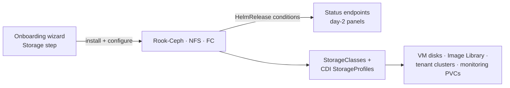

Celum installs and operates storage per supervisor through three backends. Each is a tab on the onboarding wizard's **Storage** step, each reports day-2 state through the platform's [component-status model](/platform-health/overview), and each ends the same way: one or more **StorageClasses** that every downstream consumer — tenant clusters, VMs, the Image Library, monitoring — provisions against.

| Backend | What it is | Produces |
| --- | --- | --- |
| **Rook-Ceph** | A Ceph cluster built from disks the supervisor's own nodes see — local NVMe, SAN FC LUNs, or both in one cluster | `ceph-block` (and optionally `ceph-san-block`, CephFS, object store) |
| **NFS** | The CSI NFS driver pointed at an external NAS export | An NFS StorageClass (default name `nfs`) |
| **Fibre Channel (HSPC)** | The Hitachi Storage Plug-in for Containers — dynamic volume carving on a VSP array over FC | `hspc-fc` |

They are not exclusive. A supervisor commonly runs Ceph as its default class and adds NFS for bulk file storage; a SAN-attached supervisor can feed its FC LUNs to Ceph *and* keep HSPC installed side by side.

## Choosing a backend

<Steps>
  <Step title="Local NVMe/SSD in the nodes — Rook-Ceph">
    The default path. Replicated block storage with snapshots and fast CSI clones, no external dependency. This is what the Image Library's ~seconds golden-image cloning and VM live migration are built on.
  </Step>
  <Step title="An FC array behind the nodes — Rook-Ceph on SAN LUNs first">
    The shipped pattern is a Ceph **`san` device class**: the array carves a few large LUNs per node once (masked by WWPN), and Ceph consumes them as OSDs next to the local NVMe ones — same cluster, two tiers, separate pools. The array's API is never in the runtime path, so provisioning is a Ceph operation (milliseconds), CSI clone works on FC capacity, and a path failure is absorbed by multipath or healed by replication. See [Rook-Ceph](/storage/rook-ceph#san-lun-osds--the-san-device-class).
  </Step>
  <Step title="Array-native data services required — HSPC">
    When a volume must be a first-class array object (one LDEV per PVC, array-side thin provisioning and snapshots), install the [Fibre Channel backend](/storage/nfs-and-fibre-channel#fibre-channel--hitachi-hspc). Expect array-API latency in the provisioning path and a hard multipath prerequisite on the nodes.
  </Step>
  <Step title="Existing NAS, file semantics — NFS">
    Simplest to stand up: server + export path, one StorageClass, a built-in test-PVC smoke check. Filesystem-mode only — fine for shared data, the slow path for VM images.
  </Step>
</Steps>

## What lives where

- **Install and reconfigure** happen on the wizard's Storage step. Each tab is a [chart release panel](/platform-health/overview#where-statuses-surface) plus backend-specific forms; re-opening the step hydrates the forms from the supervisor, so re-apply expresses deltas rather than re-entering everything.
- **Day-2 status** is the same status model as every other component: `exists` / `ready` / `revision` / conditions with the chart controller's reason and message. Ceph adds a second, deeper status — cluster health, OSDs, mons, pools — read live from the CephCluster.
- **Disk inventory** — every node's block devices with model, size, transport (`nvme` / `sata` / `fc` / `usb`) and a lifecycle state — feeds the Rook disk picker and the Infrastructure page's [SAN LUN panel](/platform-health/infrastructure), where FC LUNs group by WWID with their multipath path counts.
- **[Classes & profiles](/storage/classes-and-profiles)** list every StorageClass and its CDI StorageProfile — the clone strategy and access-mode/volume-mode combinations that decide VM cloning speed and live-migration eligibility.
- **[PVCs & snapshots](/storage/pvcs-and-snapshots)** browse actual claims and volume snapshots per namespace.

<Note>
  The in-product assistant, **Celum AI**, answers storage questions from these same APIs — "which class should this VM use?" or "why is Ceph degraded?" reads the identical status, class, profile, disk, and PVC data the panels render.
</Note>

## PVC Pending — the triage order

A Pending claim is the universal storage symptom. Work top-down:

<Steps>
  <Step title="Read the claim's events">
    The [test-PVC diagnostic](/storage/classes-and-profiles#the-test-pvc-diagnostic) provisions a throwaway claim against any class and returns the PVC events on failure — the provisioner's own error, without `kubectl`.
  </Step>
  <Step title="Does the class exist, and is its provisioner running?">
    Check the backend's status panel. A deleted NFS driver leaves **orphan** StorageClasses that look valid but can never bind; a Ceph cluster can be healthy while the CSI provisioner is absent.
  </Step>
  <Step title="Can the class satisfy what was requested?">
    ReadWriteMany on a class whose profile only claims ReadWriteOnce, or Block mode on file-backed storage, pends forever. The [profiles table](/storage/classes-and-profiles) shows what each class actually supports.
  </Step>
  <Step title="Is the backend itself healthy?">
    Ceph health warnings (OSDs down, degraded PGs), an unreachable NFS server, or a misconfigured FC port list all surface in the respective status — see the per-backend pages for their failure signatures.
  </Step>
</Steps>

The full checklist with per-cause signatures lives in [PVCs & snapshots](/storage/pvcs-and-snapshots#pvc-pending--the-checklist).

## Permissions

All storage backend operations map to the `storage` action family, scoped to `krn:vks:supervisor:<supervisor>:storage:*`:

| Task | Action |
| --- | --- |
| Read backend status, classes, profiles | `storage:GetStatus` |
| Read the disk inventory | `storage:Discover` |
| Install a backend, wipe disks, recover a stuck rollback | `storage:InstallDriver` |
| Create or update an NFS StorageClass | `storage:ApplyStorageClass` |
| Delete an orphan NFS StorageClass | `storage:DeleteStorageClass` |
| Run a test PVC | `storage:Test` |

Ceph cluster health reads use `ceph:GetStatus` on `krn:vks:supervisor:<supervisor>:ceph:*`. The snapshot controller and the namespace-scoped PVC/snapshot listings have their own families — see the per-page tables.

## The Storage pages

<CardGroup cols={2}>
  <Card title="Rook-Ceph" icon="database" href="/storage/rook-ceph">
    Local-disk and SAN-LUN installs, the disk picker and wipe flow, Ceph health, and rollback recovery.
  </Card>

  <Card title="NFS & Fibre Channel" icon="plug" href="/storage/nfs-and-fibre-channel">
    The external backends — NFS driver and storage classes, HSPC discover/install/status, multipath.
  </Card>

  <Card title="Classes & profiles" icon="layer-group" href="/storage/classes-and-profiles">
    StorageClasses, CDI StorageProfiles, and which class to give VMs and golden images.
  </Card>

  <Card title="PVCs & snapshots" icon="box-archive" href="/storage/pvcs-and-snapshots">
    The per-namespace claim browser, volume snapshots, the snapshot controller, and the Pending checklist.
  </Card>
</CardGroup>
