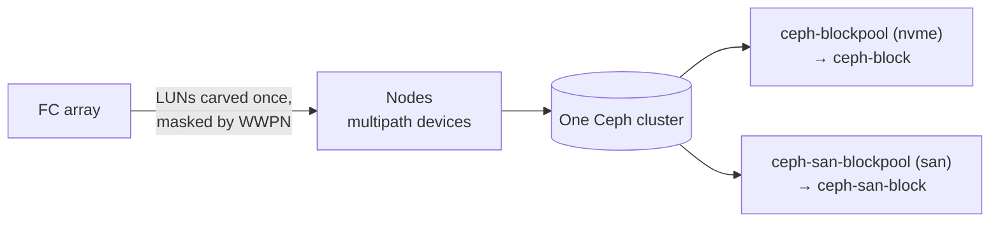

Rook-Ceph is the supervisor's distributed storage: the wizard's **Rook-Ceph** tab turns disks the nodes already see into a replicated Ceph cluster with block pools and StorageClasses. The install is two Flux HelmReleases in the `rook-ceph` namespace — the **operator** chart and the **cluster** chart, with the cluster release gated on the operator being ready so the CephCluster resource is never applied before its CRDs and controller exist. The namespace is labelled for privileged pod security automatically; Ceph's daemons need capabilities a baseline namespace rejects.

Chart versions are **pinned**, never floating — the version dropdown offers newer releases, but moving off the pinned default is a deliberate click, not something a repository update can do to you. Operator and cluster charts must stay in lockstep.


## The disk inventory

The install starts from the per-node disk inventory: every block device on every node with model, size, transport, and a lifecycle **state** that decides whether it can become an OSD:

| State | Meaning | Selectable? |
| --- | --- | --- |
| `system` | The node's OS lives here — "cannot be used as an OSD" | Never |
| `readonly` | Device reports read-only | Never |
| `active-osd` | Already an OSD in the running CephCluster spec | Shown as in-use |
| `stale-data` | Foreign filesystem or a leftover Ceph BlueStore label — "will be wiped before reuse" | Yes, auto-queued for wipe |
| `fresh` | Empty, ready | Yes |
| `unknown` | No signature data yet for this disk | Yes, but not auto-wiped |

A typical node mixes all of it — a small system SSD, a large NVMe data disk, and (on SAN-attached nodes) FC LUNs:

```json
{
  "hostname": "node-a",
  "disks": [
    { "linuxName": "/dev/nvme1n1", "model": "M.2 PCIe SSD", "transport": "nvme",
      "systemDisk": true, "state": "system",
      "stateReason": "Talos OS installed here — cannot be used as an OSD." },
    { "linuxName": "/dev/nvme0n1", "model": "NVMe SSD 4TB", "transport": "nvme",
      "state": "stale-data", "bluestoreSignature": true,
      "stateReason": "Has a stale Ceph BlueStore label from a previous install — will be wiped before reuse." },
    { "linuxName": "/dev/sdb", "model": "SAN LUN", "transport": "fc", "san": true,
      "wwid": "naa.<wwid>", "mpathById": "/dev/disk/by-id/dm-uuid-mpath-3<wwid>",
      "pathCount": 2, "state": "active-osd",
      "stateReason": "Listed as an OSD device in the running CephCluster spec." }
  ]
}
```

FC LUNs carry three extra facts: the `san` flag, the LUN's **WWID**, and the stable **multipath alias** with its live path count. A LUN reachable over two FC paths appears as two `/dev/sd*` devices but one multipath device — every leg of a consumed LUN reports `active-osd`, so you cannot double-select a LUN through its second path. The same inventory backs the Infrastructure page's [SAN LUN panel](/platform-health/infrastructure).

## Installing on local disks

Pick disks per node and set the cluster shape:

| Field | Meaning |
| --- | --- |
| Mon count | Ceph monitor quorum size (default 3) |
| Replica size | Copies per object for the block pool (default 3) |
| CRUSH failure domain | What a replica must not share — `host` by default |
| Public / cluster network CIDR | Ceph traffic placement; pre-filled from the declared storage network when one exists |
| Pools | RBD block pool (on by default), optional CephFS and object store |
| OSD resources | CPU request, memory request/limit per OSD |
| Monitoring / dashboard | Prometheus integration and the Ceph dashboard |

Apply wires the namespace, repository, and both HelmReleases; the status panel then tracks the release conditions and, once the cluster forms, live Ceph health.

### Disk preparation — the wipe

Rook refuses a disk that carries any prior signature, so disks in `stale-data` are queued for a wipe automatically as part of Apply. The wipe runs as a **privileged per-node job** that discards the whole device, with a fallback that zeroes the specific offsets where modern Ceph keeps redundant BlueStore label copies — a surface-level wipe is not enough, because backup labels deep in the disk survive it and Ceph still recognizes the old OSD, yielding zero new OSDs on a disk that *looks* clean. For SAN LUNs the wipe targets the multipath device, once per LUN, never per path.

<Note>
  **Force wipe** is the explicit override: wipe *every* selected disk, not just the auto-detected stale ones. Reach for it on a re-onboard where signature detection has nothing to scan yet, or when a previous teardown left disks in a state detection cannot classify. It is destructive by design — that is the point.
</Note>

## SAN LUN OSDs — the `san` device class

On a SAN-attached supervisor the same wizard consumes FC array LUNs as a second OSD tier in the **same** Ceph cluster:



- The array carves a few large LUNs per node **once** (a day-0 array operation); after that the array's API is never used at runtime — provisioning, snapshots, and clones are Ceph operations.
- Selected SAN LUNs are always addressed by their **multipath by-id alias**, never a `/dev/sdX` name — path names renumber on reboot and would double-consume a dual-path LUN.
- SAN OSDs join CRUSH under the `san` device class, next to the local `nvme` OSDs. Enabling **Create SAN pool** renders `ceph-san-blockpool` pinned to that class plus the `ceph-san-block` StorageClass; the local pool stays pinned to its own class, so neither tier's data ever migrates onto the other.
- The SAN pool's **replica size defaults to 2**, not 3: the array's RAID already protects the disks — Ceph's replica exists for node, path, and OSD availability, and a third copy of array-grade capacity buys little.

The payoff over a vendor CSI driver on the same array: PVC creation in seconds instead of array-API round-trips, [fast CSI cloning](/storage/classes-and-profiles) on FC capacity, and a pulled path costs nothing — multipath fails over beneath Ceph, or a single-path OSD drops and replication serves on.

<Warning>
  **Multipath is a node prerequisite, not an option**, on any dual-path SAN node: the kernel `dm_multipath` module and a multipath configuration must be active so dual-path LUNs coalesce into one device. Without it each LUN shows up twice and whatever consumes one path corrupts the other's view. The Infrastructure page's FC section shows per-port state and the SAN panel flags `single-path` LUNs — check both before selecting SAN disks.
</Warning>

## Status — two layers

**Release state** is the standard [component status](/platform-health/overview): both HelmReleases with `ready`, `revision`, and conditions, plus the full desired configuration round-tripped from the cluster — the wizard rehydrates its form and disk picker from this, so a re-apply only expresses what you changed.

**Ceph health** is the deeper read, live from the CephCluster and the Ceph daemons:

```json
{
  "health": "HEALTH_WARN",
  "phase": "Progressing",
  "message": "failed to create cluster: ... aborting OSD provisioning after waiting more than 20 minutes for OSDs to finish processing",
  "capacity": { "total": 14201384345600, "used": 2548657631232, "available": 11652726714368 },
  "warnings": [
    { "code": "OSD_DOWN", "message": "2 osds down", "severity": "HEALTH_WARN" },
    { "code": "PG_DEGRADED", "message": "Degraded data redundancy: ... 65 pgs degraded, 65 pgs undersized", "severity": "HEALTH_WARN" }
  ],
  "pools": [
    { "name": "ceph-blockpool", "kind": "BlockPool", "phase": "Ready", "replicaSize": 3 },
    { "name": "ceph-san-blockpool", "kind": "BlockPool", "phase": "Ready", "replicaSize": 2 }
  ]
}
```

The full payload also lists every OSD with its node and store, the monitor quorum, the network provider, and daemon versions. Read it the way Ceph means it: `HEALTH_WARN` with named warning codes is a cluster telling you exactly what degraded — here two OSDs down and placement groups running below replica count — while pools can simultaneously be `Ready`. Warnings name the fault; `message` carries the operator's last provisioning error when the cluster is still forming.

## Recover rollback

StorageClass parameters are immutable in Kubernetes, which occasionally deadlocks a Helm rollback: the chart controller tries to revert Ceph StorageClasses created by an older release and hits `updates to parameters are forbidden`, forever. **Recover rollback** is the dedicated unstick:

- It acts **only** when the cluster release reports that exact rollback condition — against a healthy cluster it is a no-op.
- It deletes only Rook-provisioned StorageClasses (matched by provisioner), never a foreign class.
- It **never deletes a class with bound PVCs** — those are returned as skipped for you to decide.
- It then nudges the release to re-reconcile, which recreates the classes at the current version.

## What commonly goes wrong

| Symptom | Cause and fix |
| --- | --- |
| 0 OSDs after install, disks look clean | Stale BlueStore labels survived a surface wipe — modern Ceph keeps backup labels deep in the disk. Re-run Apply with **Force wipe** on the affected disks. |
| 0 OSDs on a re-onboard, no wipe was offered | Fresh runs may classify old disks `unknown` (nothing to scan yet), so nothing auto-queues. Force wipe is the escape hatch. |
| PVCs Pending while Ceph is `HEALTH_OK` | The CSI provisioner is missing, not Ceph. Rook 1.20 stopped deploying CSI drivers itself; Celum applies the required driver resources during install, but on a fresh cluster they can trail the CRDs briefly — re-apply if the provisioner never appears. |
| SAN install: filesystem errors or I/O errors on first use | Multipath prerequisite missing — the LUN was consumed through one of two live paths. Fix multipath on the node first; the wipe + reinstall then sees one coalesced device. |
| Install stuck `Progressing` >20 min with an OSD-provisioning message | Read the Ceph status `message` and OSD list — typically a subset of disks failed preparation (see the wipe rows above) while the rest joined. |
| Upgrade wedged with `updates to parameters are forbidden` | The StorageClass immutability deadlock — use **Recover rollback**. |

## Permissions

| Task | Action | KRN |
| --- | --- | --- |
| Read install status and desired config | `storage:GetStatus` | `krn:vks:supervisor:<supervisor>:storage:*` |
| Read the disk inventory | `storage:Discover` | `krn:vks:supervisor:<supervisor>:storage:*` |
| Install, wipe disks, recover rollback | `storage:InstallDriver` | `krn:vks:supervisor:<supervisor>:storage:*` |
| Read Ceph cluster health | `ceph:GetStatus` | `krn:vks:supervisor:<supervisor>:ceph:*` |

<Warning>
  `storage:InstallDriver` covers **disk wiping**. It is a destructive permission — grant it with the same care as delete rights.
</Warning>

## Related

<CardGroup cols={2}>
  <Card title="Storage overview" icon="hard-drive" href="/storage/overview">
    When Rook-Ceph is the right backend — and when it is not.
  </Card>

  <Card title="Classes & profiles" icon="layer-group" href="/storage/classes-and-profiles">
    What `ceph-block` and `ceph-san-block` support, and why VMs want them.
  </Card>

  <Card title="Infrastructure & nodes" icon="server" href="/platform-health/infrastructure">
    The SAN LUN panel — WWID grouping, path counts, FC port state.
  </Card>

  <Card title="Platform health overview" icon="heart-pulse" href="/platform-health/overview">
    The HelmRelease status model both Rook releases report through.
  </Card>
</CardGroup>
